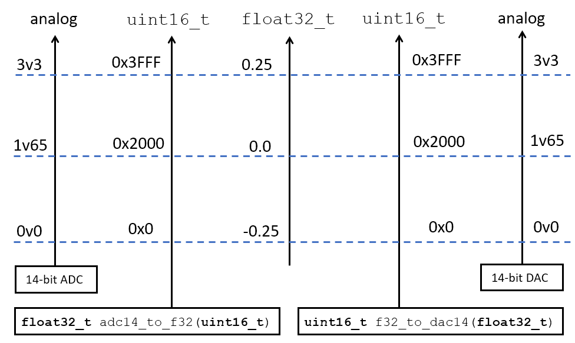
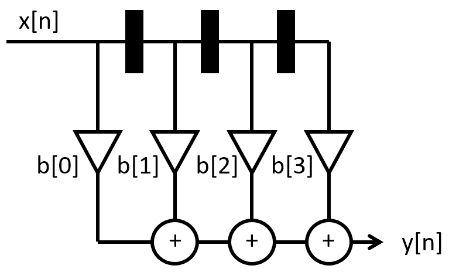
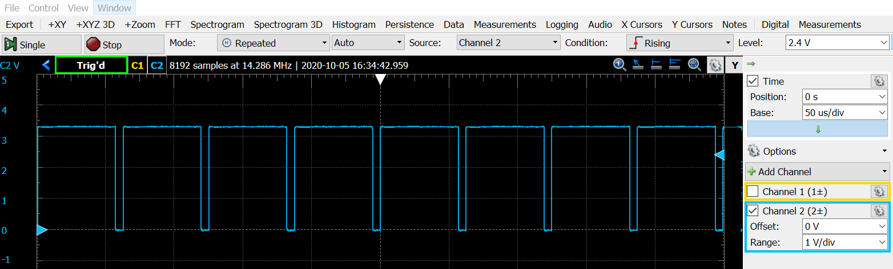
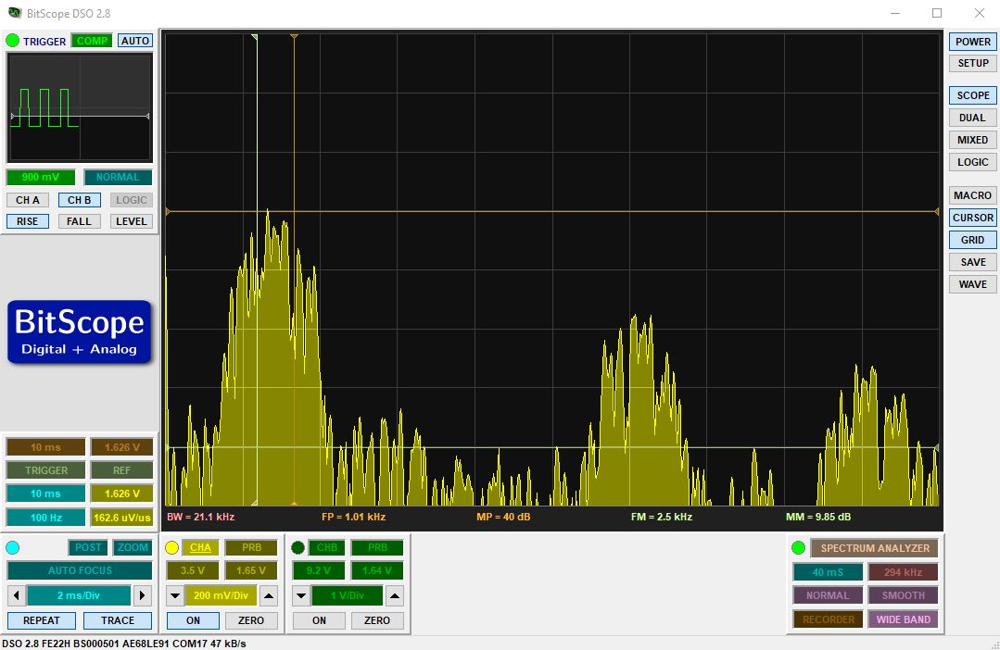
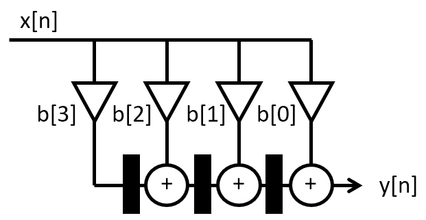

.. ECE 4703 

Lab 2 
=====

The purpose of this assignment is as follows.

* to familiarize you with the filter design tools in Matlab,
* to familiarize you with the basic calibration of signal values captured using AUDIO BOOSTXL,
* to familiarize you with the implementation of finite impulse reponse (FIR) filtering using MSP-EXP432P401R,
* to measure the impulse reponse and frequency response of an FIR implementation,
* to compare the performance of various FIR implementation styles.

.. note::

   The starter code for this lab is in a repository at *https://github.com/wpi-ece4703-b20/assignment2_teamx*,
   where x is the team number that you have chosen on the Canvas course website. All team members have access
   to this private repository.

Finite Impulse Response Filter
^^^^^^^^^^^^^^^^^^^^^^^^^^^^^^

An FIR filter with M taps is a digital filter described by the following input/output relationship

.. math::

   y[n] = \sum_{k=0}^{M-1} b[k] x[n-k]

where :math:`y[n]` is the current filter output, :math:`b[0],...,b[M-1]` are the feedforward filter coefficients,
and :math:`x[n],...,x[n-M+1]` are the current input and :math:`M-1` previous inputs. The inputs are stored
in a buffer referred to as the taps of the FIR filter. 

To compute the very first filter output :math:`y[0]` using the very first input :math:`x[0]`, one must assume
an initial value for :math:`x[-1],...,x[-M+1]`. In this assignment we will assume the initial value of the taps
of the FIR filter is 0.

This assignment is focused on the implemention of the formula to compute an FIR output using a DSP program in C.
We are primarily concerned with the correct implementation of the FIR design using floating-point precision.
In a later assignment, we will study the optimized implementation of the FIR design.

Finite Impulse Response Filter Specifications
^^^^^^^^^^^^^^^^^^^^^^^^^^^^^^^^^^^^^^^^^^^^^

In the assignment you will develop an implementation for an FIR filter with the following specifications.
You will design a bandpass filter with a passband of 2500Hz to 3500Hz, a lower stop band for frequencies below 1500Hz, an
upper stopband for frequencies above 4500Hz, a maximum passband ripple of 1dB, and a stopband minimum rejection
of 40dB for both stop bands.

You can pick any supported sample rate and any filter design method you like, as long as your design
meets all of the filter design requirements including real-time performance. You can use
Matlab filter design tools such as ``filterDesigner`` to create the coefficients for your FIR filter.
The Matlab filter design tools allow you to analyze various aspects of your filter such as
its impulse response, frequency response, and pole-zero plot, among others. The Matlab filter design
tools allow you to export the filter coefficients as a C header file. You can use these generated
coefficients directly in your program. You will perform all calculations in this assignment using
single-precision floating point numbers. 

.. note::

   C recognizes multiple floating-point precision
   levels, and the most common ones are single-precision floating point (``float``) and double-precision floating
   point (``double``). Single-precision floating point is a 32-bit datatype (a sign bit, 8 exponent bits and 23 mantissa bits), 
   while double-precision floating
   point commonly uses 64 bits.

   A floating-point constant can be written in various ways. For example, the value 0.75 can be written as
   ``0.75`` or ``75e-2`` or ``.0075e2``. Without a floating-point suffix, such a constant is treated as 
   having double precision. The floating-point suffix ``f`` can be added to indicate the compiler that
   you are providing a single-precision floating constant. Thus, the value 0.75 as a single-precision
   constant can be written as ``0.75f`` or ``75e-2f``. 

Calibration
^^^^^^^^^^^

Before you will develop your real-time DSP filter, you first have to gain insight into the calibration
of analog signals into digital floating point numbers. 
The `MSP-EXP432P401R Launchpad <https://www.ti.com/tool/MSP-EXP432P401R>`_ used for your course project contains a 14-bit Analog to Digital Converter, which
converts analog voltages between 0 volts and 3.3 volts (full scale). The processed signal from the
MSP432 processor is converted through digital audio using 
a 14-bit Digital to Analog Converter integrated on the `Audio Signal Processing Boosterpack <https://www.ti.com/tool/BOOSTXL-AUDIO>`_. The DAC converts digital codes to analog voltages between 0 volts and 3.3 volts (full scale).

The following figure illustrates the calibration of analog values to digital numbers. The ADC produces
14-bit numbers which are mapped into a 16-bit unsigned data type. These integers are converted into
single-precision floating-point numbers using ``float32_t adc_to_f32(uint16_t)``, a function
provided in :ref:`msp432_boostxl_lib`. For reasons that we will explain later, the lowest ADC value (0) is mapped to the real value -0.25, and the highest ADC value (0x3FFF) is mapped to the real value 0.25.
A floating point number can be converted back to a voltage by first converting the number to a 16-bit unsigned integer using ``uint16_t f32_to_dac(float32_t)``, and next sending that number to the 14-bit DAC. 

   Calibration Chart relating analog values, DAC/ADC values, and floating point values

We recall how a typical real-time DSP program looks like. We demonstrate the case of an interrupt-driven
sample conversion with a 24KHz sample rate.

.. code:: c
   :number-lines: 1

   #include <ti/devices/msp432p4xx/driverlib/driverlib.h>
   #include "msp432_boostxl_init.h"
   #include "msp432_arm_dsp.h"

   uint16_t processSample(uint16_t x) {
      float32_t v = adc_to_f32(x);

      // ... DSP code goes here

      return f32_to_dac(v);
   }

   int main(void) {
       WDT_A_hold(WDT_A_BASE);
   
       msp432_boostxl_init_intr(FS_24000_HZ, 
                                BOOSTXL_J1_2_IN, 
                                processSample);
       msp432_boostxl_run();

       return 1;
   }

.. important::

   **Question 1**: Create a sinewave generator that generates a sine wave with the following properties.

   * Frequency: 1000 Hz
   * Sample Frequency: 16KHz
   * Amplitude: 300mV
   * Offset (with respect to 1.65V ref level): +200mV

   Use a lookup table to store 16 samples of a sine wave as floating point numbers. Use the
   calibration diagram listed above to find the proper floating-point scaling factors for the 
   amplitude and the offset.

Filter Coefficient Generation
^^^^^^^^^^^^^^^^^^^^^^^^^^^^^

Use the Matlab ``filterDesigner`` tool to create a FIR according to the passband specifications provided
earlier. You can choose any suitable sample frequency as long as it yields a filter that meets the passband
specifications. 

.. important::

   **Question 2**: Generate floating point coefficients that can be included in a C file. 
   When your design is complete, extract the following information from  ``filterDesigner``: 
   the filter's impulse response, the filter's amplitude response, the filter's phase response, 
   and the filter's pole-zero plot. You will include these plots in your report.
   
Filter Implementation: FIR Direct Form
^^^^^^^^^^^^^^^^^^^^^^^^^^^^^^^^^^^^^^

Implement a Direct-Form FIR filter using the coefficients created earlier. 
Attach the filter input to pin ``BOOSTXL_J1_2_IN`` so that you can inject an external test waveform.
The first implementation is the so-called Direct Form implementation, illustrated in the figure below.
You will have to adjust the number of taps of the filter to the number identified by the Matlab
filter design program.

   Direct Form FIR filter

To test the filter, attach a signal generator to pin ``BOOSTXL_J1_2_IN``, and insert a sine wave
with amplitude 500mV and offset 1.65V. As you vary the frequency from 200Hz to 5KHz, you should hear
the tone sound louder until it reaches around 2500Hz, and then grow silent again as you
increase the frequency beyond 3500Hz.

.. note::

   Getting a complex filter operation to work 'out of the box' is challenging, so if the filter does
   not work as described above, don't despair. You can work systematically through the design
   to make sure that everything works as expected. Here are some tips.

   First, the MSP432EXP401R does not have a straightforward error reporting. One of the first, basic
   tests that you can do, is to verify that the program is running. The ``DAC_SYNC``, which
   toggles once for every two bytes transmitted to the DAC, enables you to verify that
   there is digital data moving from the MSP432EXP401R microcontroller to the DAC on the
   Audio BoostXL board. To measure this signal, connect an oscilloscope probe to
   pin ``D sync`` on header J2 of the Audio BoostXL board. If you don't observe a DAC sync
   pulse, but you believe that there should be one,  then the MSP432EXP401R may have suffered
   an exception -- which halts execution of the DSP program. Such an exception typically
   occurs when you have an out-of-bounds array access.

   Second, if the program is running, but you don't get any output, you may need to observe
   the signal being send to the audio amplifier. Refer to :ref:`connect_scope` to check where
   you need to connect the oscilloscope probe. Once the oscilloscope is connected you can
   perform simple tests - such as applying 0v or 3V3 to the input pin  ``BOOSTXL_J1_2_IN``,
   and verifying that the output level of the DAC reacts correspondingly. Work systematically
   through the signal processing chain from the input to the output. Verify your work
   frequently and make small modifications at a time.

   Finally, you can rely on the source-level debugger included in Code Composer Studio.
   However, since the source-level debugger essentially halts the real-time behavior
   of the program (masking further interrupts etc), this debugging technique is not
   very helpful to identify issues related to the real-time nature of the processing.
   

   DAC SYNC of an audio stream at 16KHz sample rate

Once your filter appears to be working correctly, you have to demonstrate its correct operation
by making the following two measurements.

1. You have to measure the Amplitude response of the FIR filter.
2. You have to measure the performance (in clock cycles) of your FIR design

Measuring the amplitude response of the FIR filter
""""""""""""""""""""""""""""""""""""""""""""""""""

The amplitude response of the FIR filter is obtained by computing the spectrum of the filter's output while
it is processing a broadband signal. In simulation, such a broadband signal is typically created through
an impulse -- so that the filter's response in the time domain is the impulse response, and the response in
the frequency domain is the amplitude response. Such an impulse is not easy to process by practical
hardware as it concentrates the energy of the complete spectrum into the steep edges of a time domain pulse. 
Instead, it is easier to inject a white noise signal as the broadband input signal. A white noise signal
is a broadband signal with uniform energy levels at every frequency. However, the phases of the frequency components in the white noise signal are random, the energy is distributed in time. 

As a sampled-data signal, a white-noise signal is created using a random sequence created from a uniform distribution. The C function ``rand()`` generates random numbers between 0 and a large constant ``RAND_MAX``.
For measuring the FIR filter, the randum number stream needs to be properly scaled: the average needs to be around 0x2000 (the '0 volt' level for the DAC) with a uniformly distributed range of numbers around that central value.

To apply the white noise signal, simply change the input of the ``processSample`` function in your program
to take the input from your random number generator:

.. code:: c
   :number-lines: 1

   uint16_t processSample(uint16_t x) {
      // float32_t v = adc_to_f32(x);

      float_t v = my_scaled_random_number_generator(); // you have to design this function

      // ... DSP code goes here

      return f32_to_dac(v);
   }

To compute the filter output spectrum, you can make use of the spectrum analysis function present
in typical USB oscilloscopes. Because the output spectrum is computed from a random input
sequence, it will tend to be noisy. For this lab, you can make use of the Spectrum Analyzer function
of Bitscope to demonstrate that your filter is operational. You should be able to show that the passband
covers 2500 Hz to 3500 Hz, and that the stopband suppression reaches 40 dB. The following is an example
spectrum recorded from a working filter.

Measuring the performance of the FIR filter
"""""""""""""""""""""""""""""""""""""""""""

The performance of the FIR filter is the amount of clock cycles required to process a 
single signal sample. The total amount of clock cycles available to process a sample
equals ``48 MHz / sample frequency``. For example, at 16KHz there are 3000 clock cycles
available for each sample. Hence, it is important to understand how much computation
effort is needed to process one sample.

The ``MSP432_BOOSTXL_LIB`` has a built-in function to compute the performance for you:
``uint32_t measurePerfSample(msp432_sample_process_t _cb)``. Study the source code of
this function to understand how it works. You would typically call ``measurePerfSample`` during
the initialization phase of the program, before you start the signal processing loop.
The return of this function is the number of clock cycles needed to complete the function.
You can ``printf`` this number and read it from the console in the debugger of
Code Composer Studio.

.. important::

   **Question 3**: Write the C function that computes the FIR using Direct Form.
   You have to report the following data for this function:

   1. The source code listing of ``uint16_t processSample(uint16_t x)``
   2. The amplitude response of the implementation
   3. The performance of the implementation

Filter Implementation: Optimizing the FIR Direct Form
^^^^^^^^^^^^^^^^^^^^^^^^^^^^^^^^^^^^^^^^^^^^^^^^^^^^^

Closely study the filter coefficients. Optimize your filter design for performance by
exploiting the symmetry available in the filter coefficients.

Once you made the necessary modifications, repeat the same measurements as above:
measure the frequency spectrum of the filter, and the performance of the filter.

.. important::

   **Question 4**: Write the C function that optimizes the FIR direct form.
   You have to report the following data for this function:

   1. The source code listing of ``uint16_t processSample(uint16_t x)``
   2. The amplitude response of the implementation
   3. The performance of the implementation

Filter Implementation: The FIR Transpose Form
^^^^^^^^^^^^^^^^^^^^^^^^^^^^^^^^^^^^^^^^^^^^^

The following transformation of the filter is called the Transpose Form.
It is functionally identical to the Direct Form (with the same coefficients),
but it stores intermediate results in the filter taps, rather then the
previous input values.

   Transpose Form FIR

Implement this filter and perform the same measurements as you did for the
other two filters.

.. important::

   **Question 5**: Write the C function that optimizes the FIR transpose form.
   You have to report the following data for this function:

   1. The source code listing of ``uint16_t processSample(uint16_t x)``
   2. The amplitude response of the implementation
   3. The performance of the implementation

Wrapping Up
^^^^^^^^^^^

* The answer to this lab consists of a written report which will be submitted on Canvas by the deadline. Refer to the General Lab Report Guidelines for details on report formatting. You will only submit your written report on Canvas. All code developed must be returned through github.

* Not everybody in the class may be using the same setup to make oscilloscope measurements. Start your report with a short introduction on your measurement setup including the MSP-EXP432P401R kit, the oscilloscope and the signal generator that you have used for this lab. 

* Follow the five questions outlined above to structure your report. Optionally answer the bonus question. Use figures, screenshots and code examples where appropriate. Please work out the answers in sufficient detail to show your *analysis*.

* Make sure that you add newly developed projects to your github repository. Further, make sure that you commit and push all changes to the github repository on GitHub classroom. Use the Team - Commit pop-up menu and push all changes.

* Be aware that each of the laboratory assignments in ECE4703 will require a significant investment in time and preparation if you expect to have a working system by the assignment’s due date. This course is run in “open lab” mode where it is not expected that you will be able to complete the laboratory in the scheduled official lab time. It is in your best interest to plan ahead so that you can use the TA and instructor’s office hours most efficiently.

*Good Luck*

Grading Rubric
^^^^^^^^^^^^^^

+---------------------------------------------------------+------------+
| Requirement                                             |   Points   |
+=========================================================+============+
| Question 1 Analysis                                     |    15      |
+---------------------------------------------------------+------------+
| Question 2 Analysis                                     |    15      |
+---------------------------------------------------------+------------+
| Question 3 Analysis                                     |    15      |
+---------------------------------------------------------+------------+
| Question 4 Analysis                                     |    15      |
+---------------------------------------------------------+------------+
| Question 5 Analysis                                     |    15      |
+---------------------------------------------------------+------------+
| All projects build without errors or warnings           |     5      |
+---------------------------------------------------------+------------+
| Code is well structured and commented                   |     5      |
+---------------------------------------------------------+------------+
| Git Repository is complete and up to date               |     5      |
+---------------------------------------------------------+------------+
| Overall Report Quality (Format, Outline, Grammar)       |    10      |
+---------------------------------------------------------+------------+
| **TOTAL**                                               | **100**    |
+---------------------------------------------------------+------------+
