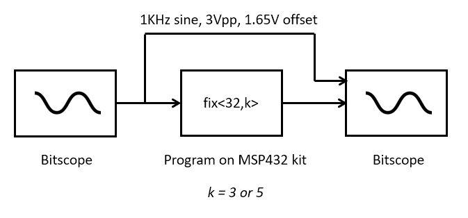
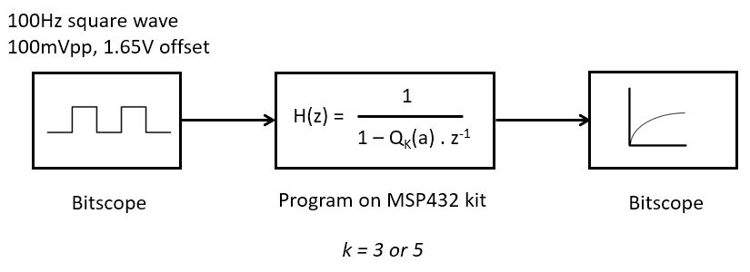
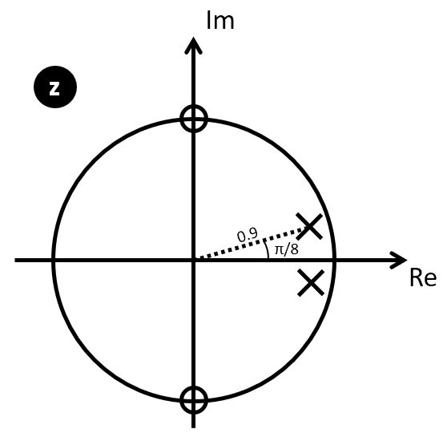
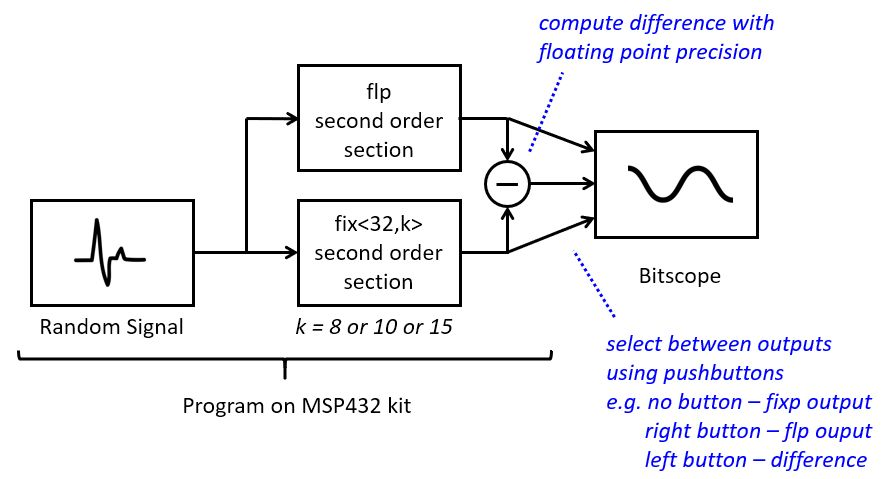

.. ECE 4703 

Lab 4 
=====

The purpose of this assignment is as follows.

* to study the impact of quantization on a signal spectrum,
* to study the impact of quantization on a filter characteristic,
* to measure quantization noise by comparing a floating-point and a fixed-point filter in real time.

.. important::

   Before you start compiling code for this lab, make sure to update the MSP432_BOOSTXL library.
   In Code Composer Studio, select the library project, then right-click and select 'Team..Pull'.
   Then, re-build the library before compiling the assignment 4 labs.
   The updated version includes support for the pushbuttons on your MSP432 kit. 

Fixed Point Implementation requires Quantization
^^^^^^^^^^^^^^^^^^^^^^^^^^^^^^^^^^^^^^^^^^^^^^^^

In Lecture 6, we discussed a technique to reduce the implementation cost (energy-wise or
performance-wise) of a DSP design, by converting the floating-point computations to
fixed-point computations. A side-effect of fixed-point design is the requirement to
reduce the resolution (precision) of a signal representation. In a fixed-point
representation of ``fix<N,k>``, the weight of the least significant bit is the fixed value
:math:`2^{-k}`, and no signal changes smaller than that quantity can be represented.

We will study the consequences of the conversion from floating-point representation to fixed-point representation by means of a series of three experiments. For each experiment, you will have to write (or modify) a short program, run it on your board and analyze the resulting signal in the time domain or in the frequency domain. The outcome of this lab consists of the software programs you will write as specified, and the written report with the analysis of the effects you observe.

Impact of Quantization in the time and frequency domain
^^^^^^^^^^^^^^^^^^^^^^^^^^^^^^^^^^^^^^^^^^^^^^^^^^^^^^^

To support your experiments, you must first write two functions.

.. code::

   int float2q(float x, int f) {
      // .. written by you
   }

``float2q(x,f)`` converts a floating point number ``x`` to a fixed point number ``fix<32,f>``.
The output datatype is an ``int``, a signed integer. Consult Lecture 6 if you need to refresh your mind on the relation ship between floating point representation and fixed point representation.

.. code::

   float q2float(int q, int f) {
      // .. written by you
   }

``q2float(q,f)`` converts a fixed point number ``q`` of type ``fix<32,f>`` to a floating point number. Again, consult Lecture 6 if you need to refresh your mind on the relation ship between floating point representation and fixed point representation.

With these two functions in hand, we can easily study the effect of fixed-point refinement, that is, we can study the effect of quantization on a DSP program written with ``float``. For example, to quantize the floating point number 0.1 to 5 fractional bits, we write:

.. code::

   float p = q2float(float2q(0.1, 5), 5);

In this example, ``p`` will be quantized to 0.09375, which is :math:`2^{-4} + 2^{-5}`, or the fractional bitpattern ``.00011``.

Your first task is to write a program that passes the input to the output while quantizing the signal to ``k`` fractional bits (with :math:`k \in \{3,5\}`). Then, you will apply a 1 KHz sinusoid to the input, and study the spectrum of the output signal with and without quantization. You can complete the program ``a4_question1`` to achieve the required implementation for this part.

Once you have written the program, construct the setup as shown on the figure above. Using BitScope, apply a 1KHz sine wave, 3V peak-to-peak, 1.65V offset to the ADC input. Capture the output of the DAC (after the lowpass reconstruction filter), and monitor both input and output on the oscilloscope. 

Next, compare the following three designs.

1. The output is directly passed from the input:

.. code::

   output = input

2. The output is quantized on a ``fix<32,5>``:

.. code::

   output = q2float(float2q(input, 5), 5);

3. The output is quantized on a ``fix<32,3>``:

.. code::

   output = q2float(float2q(input, 3), 3);

.. important::

   Question 1: For each implementation case described above, answer the following questions. 

   In the time domain, describe the waveform. Explain anomalies and non-linearities, and in particular try to explain the *cause* of anomalies and non-linearities. 

   In the frequency domain, describe the spectrum over the entire band from DC to the sampling frequency. Identify anomalies and try to explain their *cause*. 

   Finally, make sure to compare these three cases to each other (i.e., compare the case of no quantization, to quantization with 5 fractional bits, to quantization with 3 fractional bits). We are looking for more than just a single line of text; make a good analysis of what you see.

.. note::

  Four new functions have been added to the MSP432_BOOSTXL library to help you write your test program.

  .. code::

      int pushButtonLeftUp();
      int pushButtonLeftDown();
      int pushButtonRightUp();
      int pushButtonRightDown();

  The functions indicate if the buttons on the side of the MSP432P401R board are depressed or not.
  You can use these functions for quick comparison of implementations. For example, you can write the ``processSample`` filtering
  function as follows.

  .. code::

     uint16_t processSample(uint16_t x) {
       float input;

       input = adc14_to_f32(x);

       float v;
       if (pushButtonLeftDown()) {
         v = input;
       } else {
         v = q2float(float2q(input,5),5);
       }

       return f32_to_dac14(v);
     }

  This code will pass the input to the output, but will quantize the output to 5 fractional bits when you press 
  the left button. This enables you to quickly compare the spectrum of the non-quantized case to the quantized case.

Impact of quantization on filter characteristic
^^^^^^^^^^^^^^^^^^^^^^^^^^^^^^^^^^^^^^^^^^^^^^^

Next, we will study the impact of quantization on filter coefficients.
Consider a first-order low-pass filter.

.. math::

   H(z) = \frac{1}{1 - a.z^{-1}}

This filter has a single pole at location :math:`z = a`. In a filter with quantized coefficients, the location of the poles (or zeroes) can shift compared to their original floating-point position. This, in turn, will affect the filter characteristic.

Now construct a program that implements a first-order low-pass filter, where ONLY the filter coefficient is quantized.
You can do this with the same functions as used earlier, i.e. to quantize floating-point coefficient a with k fractional
bits, use ``q2float(float2q(a,k),k)``. Implement the filter with a pole located at z = 0.9. You can complete the 
program ``a4_question2`` to achieve the required implementation for this part.

Next, construct a measurement setup that applies a square wave at the input with 100 mVpp amplitude, 1.65V offset, and 100 Hz.
Observe the output in the time domain, and compare three cases.

1. The filter coefficient a is unmodified

2. The filter coefficient a is quantized to k=5 fractional bits

3. The filter coefficient a is quantized to k=3 fractional bits

.. important::

   Question 2: For each implementation case described above, precisely observe the output waveform in the time domain.
   Note the amplitude and offset of each output waveform. Are they identical or not? Explain the cause of your observations 
   by your insight in the quantization process and its effect on the filter coefficient of :math:`H(z)`.

Measuring Quantization Noise of a Fixed-point Filter Design
^^^^^^^^^^^^^^^^^^^^^^^^^^^^^^^^^^^^^^^^^^^^^^^^^^^^^^^^^^^

The final part of the lab is to implement a complete filter as a fixed-point design.
We will quantize the input and output, as well as the filter coefficients.
Instead of doing floating-point computations, we will implement the
entire filter using integer computations. We will measure the response of this 
quantized filter, and measure its quantization noise by comparing with a 
floating-point version of the same filter in real time.

The filter you have to implement is a second-order filter described by the
following pole-zero plot. The zeroes are located at :math:`n_{1,2} = e^{\pm j \pi/2}`
and the poles are located at :math:`p_{1,2} = 0.9 e^{\pm j \pi/8}`.

In selecting the filter coefficients, pay attention to the proper scaling
of filter coefficients. Ideally, the sum of the absolute filter coefficients
should be equal to 1. For example, if you scale
each filter coefficient :math:`h_i` by :math:`\frac{1}{\sum_i (abs(h_i))}`,
the filter has unit power. This scaling helps to prevent overflow at the output.

Your filter design has to implement a floating point filter, a fixed point filter,
as well as the difference between them. Thus, your DSP program will compute one
of three possible outputs, as shown in the following flow diagram.

A random signal generator is used at the filter's input. 

The second-order section can be implemented using an architecture of your choice:
direct-form I or II, or transposed direct-form. Refer to the examples 
given in Lecture 5 for sample implementations of such filters.

The fixed-point design will compare the floating-point design for two
different quantization levels: 8 bits and 10 bits. Scaling
of the fixed-point design applies to all aspects of the filter: the 
coefficients, the signals as well as to the intermediate results.

Use the following practical guidelines to build up your implementation.

1.  Start with the floating-point implementation and verify that the filter works correctly, before building the fixed-point version. Write a small amount of code at a time and test extensively, after every modification.

2. Use the pushbuttons to switch the filter output between floating-point version, fixed-point version, and difference, in order to quickly diagnose the difference.

3. To scale the output of the ADC to 8 or 10 bits, work as follows. Use a ``adc14_to_q15()`` function to convert an ADC code to fix<32,15>. Then scale the input to the proper precision by additional shifts. For example, to get an 8-bit output, use ``adc14_to_q15(...) >> (15 - 8)``.

4. In selecting the random input signal, do not max out the range. For example, stay between 1/4 and 3/4 of the full input  scale of the ADC (refer also to the `scale comparing voltage, floating point, and fixed point precision <https://schaumont.dyn.wpi.edu/ece4703b20/lecture6.html#fixed-point-quantization-on-the-msp-432-kit>`_ as discussed in Lecture 6).

5. To compare the output of the floating point filter with the fixed-point filter, convert the output of the fixed-point filter to floating point, and compute the difference in floating point. Since both filters were designed from the same coefficients and both filters compute the same signal, the difference is the quantization noise caused by the fixed point design. Realistically, the higher the number of fractional bits used by the fixed-point filter, the lower the quantization noise.

6. You can complete the program ``a4_question3`` to achieve the required implementation for this part.

.. important::

   Question 3: Build the filter design as described above, and compare the filter output in the time domain for quantized filters of 10 and 8 fractional bits respectively. 

   Characterize the signal in the time domain as follows. 

      (a) Take a screen shot in Bitscope from the quantization noise signal as well as a screen shot of the fixed-point signal (for 10 and 8 fractional bits). 

      (b) Download the following signals (using the csv download feature): the floating-point output, and the quantization noise. Compute the following for each of these signals: the average, the minimum, the maximum, and the standard deviation (ie. the average power with the DC component removed).

.. important::

   Question 4: Build the filter design as described above, and compare the filter output in the frequency domain for quantized filters of 10 and 8 fractional bits respectively. 

   Take a screen shot in Bitscope from the spectrum of the quantization noise signal as well as a screen shot of spectrum of the fixed-point filter output. Analyze your results and point out specific features in the signal spectrum.

Wrapping Up
^^^^^^^^^^^

* The answer to this lab consists of a written report which will be submitted on Canvas by the deadline. Refer to the General Lab Report Guidelines for details on report formatting. You will only submit your written report on Canvas. All code developed must be returned through GitHub.

* Follow the principal structure of the report you've used for Lab 3 (taking into account any feedback you have received).

* Follow the four questions outlined above to structure your report.  Use figures, screenshots and code examples where appropriate. Please work out the answers in sufficient detail to show your *analysis*.

* Make sure that you add newly developed projects to github: Use the Team - Share pop-up menu and select your repository for this lab. Further, make sure that you commit and push all changes to the github repository on GitHub classroom. Use the Team - Commit pop-up menu and push all changes.

* Be aware that each of the laboratory assignments in ECE4703 will require a significant investment in time and preparation if you expect to have a working system by the assignment’s due date. This course is run in “open lab” mode where it is not expected that you will be able to complete the laboratory in the scheduled official lab time. It is in your best interest to plan ahead so that you can use the TA and instructor’s office hours most efficiently.

*Good Luck*

Grading Rubric
^^^^^^^^^^^^^^

+---------------------------------------------------------+------------+
| Requirement                                             |   Points   |
+=========================================================+============+
| Question 1 Analysis                                     |    15      |
+---------------------------------------------------------+------------+
| Question 2 Analysis                                     |    15      |
+---------------------------------------------------------+------------+
| Question 3 Analysis                                     |    25      |
+---------------------------------------------------------+------------+
| Question 4 Analysis                                     |    20      |
+---------------------------------------------------------+------------+
| All projects build without errors or warnings           |     5      |
+---------------------------------------------------------+------------+
| Code is well structured and commented                   |     5      |
+---------------------------------------------------------+------------+
| Git Repository is complete and up to date               |     5      |
+---------------------------------------------------------+------------+
| Overall Report Quality (Format, Outline, Grammar)       |    10      |
+---------------------------------------------------------+------------+
| **TOTAL**                                               | **100**    |
+---------------------------------------------------------+------------+
