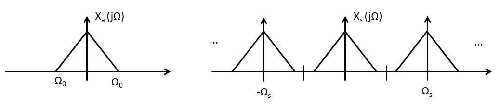

.. ECE 4703 

L1: Sampling and Quantization, Reconstruction 
=============================================

The purpose of this lecture is as follows.

* To review the basic properties of the spectra of sampled-data signals
* To discuss the process of signal sampling and reconstruction
* To review the internal design of signal sampling (hardware and software) in our lab kit

Signal Sampling
^^^^^^^^^^^^^^^

Where else can we start a course on Real Time Digital Signal Processing then at
the interface between the physical world of signals and the digital world of numbers?
We will discuss the process of converting analog signals to digital codes (integers
and floating-point numbers), as well as the reverse process of reconstructing
analog signals from those digital codes.

A fundamental difference between the discrete world of numbers and the continuous
world of signals, is the reduction of accuracy. The physical world is continuous
(if we ignore quantum-mechanics). 
For example, a voltage between 0 Volt and 1 Volt can take on *any* value between 
those two boundaries. Furthermore, assume that that voltage will change
at some time between 8 AM and 8:01 AM, the change could happen at *any* moment
during that minute-long interval. Hence, the physical world is *continuous*. 
Physical quantities such as voltage, and physical time both are continuous.

In Digital Signal Processing, we will represent these continuous values using discrete samples. Time, as well as values, become discrete.

* Time is characterized as a sequence of sample instants. The *sample period* is the time interval between sample instants. The *sample frequency* is the reciprocal,  the frequency at which samples are taken.

* Physical quantities are characterized by a sequence of discrete values  (integers with a limited resolution). The *resolution* is the number of  bits used to represent those physical quantities. The *span* is the difference between the smallest and the largest physical value represented. The *quantization step* is the smallest change of the physical quantity that will use a different discrete value.

The conversion of a physical signal to a discrete set of finite-precision numbers is called *signal sampling*.
It includes the following steps.

1. **Sample-and-hold**: An analog signal :math:`x_a(t)` is sampled to a discrete-time signal :math:`x(n)`.
2. **Quantization**: A discrete-time signal :math:`x(n)` is converted to a quantized signal :math:`\hat{x}(n)`.
3. **Encoding**: A quantized discrete-time signal :math:`\hat{x}(n)` is converted to a digital code :math:`c(n)`.

In the following, let's focus on what happens in the sample-and-hold step. 
The discrete-time signal :math:`x(n)` can be represented as a sampled continuous-time signal :math:`x_s(nT_s)` as
follows. Given the sample period :math:`T_s`, form the pulse sequence :math:`s_a(t)` as follows:

.. math::

  s_a(t) = \sum_{n} \delta(t - nT_s)

Next, multiply the analog signal :math:`x_a(t)` with the pulse sequence to obtain :math:`x_s(t)`.

.. math::

  x_s(t) = x_a(t) . s_a(t) = \sum_{n} x_a(nT_s) . \delta(t - nT_s)

The discrete-time signal :math:`x(n)` is the sequence of values taken on by :math:`x_s(t)` at the sample interval,
so that :math:`x(n) = x_a(nT_s)`.

.. note::

   Background reading:

   * Schaum's outlines on Digital Signal Processing 2nd Ed. 3.1-3.3

Frequency-Domain Characterization of sampled-data signals
"""""""""""""""""""""""""""""""""""""""""""""""""""""""""

We look for the relationship between the frequency spectrum of :math:`x_a(t)` and :math:`x_s(t)`.

Let :math:`X_a(j\Omega)` be the continuous-time spectrum of :math:`x_a(t)`, and let :math:`X_s(j\Omega)`
be the continuous-time spectrum of :math:`x_s(t)`. We also know that the spectrum of a pulse sequence
is a pulse sequence, i.e. if :math:`s_a(t)` is a pulse sequence as defined above, then

.. math::

  S_a(j\Omega) = \frac{2.\pi}{T_s} \sum_{n} \delta(\Omega - k\Omega_s)

Now, the sampled-data signal :math:`x_s(t)` is defined by the product of the continuous-time signal
:math:`x_a(t)` and the pulse sequence :math:`s_a(t)`. The spectrum of a signal which is given
by the *multiplication* of two signals in the time domain, is equal to the *convolution* of the
spectrum of each signal:

.. math::

  x_s(t) = x_a(t) . s_a(t) \Leftrightarrow X_s(j\Omega) = X_a(j\Omega) \star S_a(j\Omega)

Therefore, the spectrum :math:`X_s(j\Omega)` contains infinitely many copies of :math:`X_a(j\Omega)`,
spaced at an interval :math:`\Omega_s` apart.

.. math::

  X_s(j\Omega) = \frac{1}{T_s} \sum_{k} X_a(j\Omega - jk\Omega_s)

Given the bandwidth-limited signal spectrum :math:`X_a(j\Omega)`,
we can draw the sampled-data signal spectrum as follows.

It's easy to see that, as long as :math:`\Omega_0 < frac{\Omega_s}{2}`, the subsequent copies
of :math:`X_a` in :math:`X_s` will not overlap, and :math:`X_a` can be perfectly reconstructed
from :math:`X_s` using a filter operation. This is a remarkable property and it's worth to let
it sink in. The time-domain representation of :math:`X_s` is a series of impulse, corresponding
to the values taken from :math:`x_a(t)`. Yet, because the frequency content of :math:`x_a(t)` is
bounded, it's possible to perfectly recreate every value between the samples. Formally, this
property is called the Nyquist Sampling Theorem. 

.. important::

   **Nyquist Sampling Theorem**: If :math:`X_a(j\Omega) = 0` when :math:`| \Omega | > \Omega_0`, then :math:`x_a(t)` can be recovered from :math:`x_a(nT_s)` as long as :math:`\Omega_s = \frac{2pi}{T_s} \geq 2.\Omega_0`

   The **Nyquist rate** of a signal is two times the highest frequency component of that signal.

Quantization and Encoding
"""""""""""""""""""""""""

After sampling, the signal sequence :math:`x(n)` is converted into a quantized sequence. A quantizer is a non-linear function that maps continuous values :math:`x(n)` into quantized values :math:`\hat{x}(n)`. It's easy to represent this graphically. 

The following shows a 3-bit uniform quantizer. The *quantization step* :math:`D` is the smallest quantity by which the output can change. In total, there are 8 quantization levels, leading to a resolution of  :math:`r=3` bits. The *span* of the quantizer is :math:`D.2^r` or :math:`8D`. The quantized values ranges from :math:`-4.5D` to :math:`+3.5D`. Outside of  the span, the output of the quantizer is implementation-dependent. In the case of the figure, which is similar to most Analog to Digital Converter modules, the quantizer saturates at the most negative or most positive value.

.. figure:: images/quantizer.jpg
   :figwidth: 400px
   :align: center

Note that a quantizer does not have to be symmetric around zero. The following shows a uniform quantizer
for strictly positive values. 

.. figure:: images/quantizerplus.jpg
   :figwidth: 400px
   :align: center

Finally, the output of the quantizer  :math:`\hat{x}(n)` is mapped into a set of binary code words :math:`c(n)`.
A straightforward implementation is to generate unsigned binary code words, which increment from 000..000 for
the lowest quantization level to 111..111 for the highest quantization level.

Signal Sampling on the MSP432
^^^^^^^^^^^^^^^^^^^^^^^^^^^^^

The MSP432 on the lab kit contains a 14-bit successive-approximation ADC. 
The ADC is fully configurable from software. In the following, we summarize
the operation of the ADC as used by the :ref:`msp432_boostxl_lib`. Detailed
information on the MSP432 ADC can be found in the `MSP432 Technical Reference
Manual <https://www.ti.com/lit/ug/slau356i/slau356i.pdf>`_.

First, let's summarize the design abstraction levels that are relevant
to understand the operation of sampling from a technical perspective.
From the lowest abstraction level (i.e., closest to hardware) to the highest abstraction level 
(i.e., closest to the software application), we enumerate the abstraction
levels as follows. 

1. **Hardware Schematics**: The physical implementation of the MSPEXP432P401R board and the
   audio frontend BOOSTXL_AUDIO are each described in a user manual, 
   the `MSPEXP432P401R User Guide <https://www.ti.com/lit/ug/slau597f/slau597f.pdf?ts=1603332612648>`_
   and the `AUDIO-BOOSTXL User Guide <https://www.ti.com/lit/ug/slau670a/slau670a.pdf?ts=1603332154881>`_.
   These user guides show the physical connections of components on the board, including
   the connector pin definitions as well as the schematics.

2. **Hardware Details**: Additional documentation on the hardware details of individual components on these PCB's is
   captured in the datasheets for these components. For MSP432 is a fairly complex
   microcontroller, which has a `datasheet <https://www.ti.com/lit/ds/symlink/msp432p401r.pdf>`_
   and a low-level `technical reference manual <https://www.ti.com/lit/ug/slau356i/slau356i.pdf>`_.
   The datasheet lists device-specific information (such as the precise configuration of
   pin-to-peripheral assignments), while the technical reference manual describes how to
   program the MSP432 peripherals.

3. **Hardware Abstraction Library**: The low-level programming on the MSP432 is handled through a separate library (aptly named
   DriverLib) which is part of the MSP432P401R Software Development Kit. The documentation for
   this library can be found through CCS Resource Explorer. It can also be 
   `downloaded as a PDF <http://dev.ti.com/tirex/explore/node?node=AJIAWhC7vhw.P.ggQJeRmw__z-lQYNj__LATEST>`_
   This library introduces higher level functions that simplify peripheral programming.

4. **DSP Application Library**: The make the programming of DSP applications on the MSP432 easier, we have added 
   a software layer on top of the DriverLib. This software library, called MSP432_BOOSTXL_LIB,
   was developed specifically for this class, and its documentation is 
   `avalailable on the course website <https://schaumont.dyn.wpi.edu/ece4703b20draft/techdoc.html#msp432-boostxl-lib>`_.

5. **DSP Application**: Finally, the application software forms the top of this stack. The application software for
   real-time DSP projects in this class will be written using a cyclic-executive model, ie.
   there is no RTOS involved.

Let's consider these abstraction levels for the case of the loopback application of Lab 1.

Microphone Pre-amp
""""""""""""""""""

In the schematics of the AUDIO-BOOSTXL board, we find a schematic the microphone pre-amplifier:

This is a non-inverting op-amp configuration with a gain of approximately 250 (200000 / 820). At the output of the pre-amplifier, there's a first-order low-pass filter with a cut-off frequency of :math:`\frac{1}{2 . \pi . 820 . 0.015\mu} = 12.9 KHz`. Such lowpass filters are very common before analog-to-digital conversion, as they help ensure that the analog input signal is bandwidth limited.

Next, the amplified microphone signal is wired to a header pin of the AUDIO-BOOSTXL board, and from there to a corresponding header pin on the MSP432 board. To find the pin definitions of each of these headers, you have to consult the User Guide for each board. The microphone is wired to the 'Analog In' pin of the BoosterPack header, which in turn is connect to a pin labeled `A10 RTCLK MCLK P4.3`. The important piece of information is `A10`, which stands for 'ADC input channel 10'. That input pin is shared with several other microcontroller functionalities (`RTCLK MCLK P4.3`) - which will be inactive when we use the pin as an analog input pin.

MSP432 Microcontroller
""""""""""""""""""""""

We are now in the MSP432 microcontroller. The MSP432 datasheet gives a summary of the (large) amount of
peripherals present in this microcontroller. One of them is the ADC. Signal samples are transported
over the internal data bus to an ARM Cortex-M4F processor. The ARM Cortex-M4F is a RISC micro-processor with a three-stage
pipeline. 

The 'F' suffix in 'Cortex-M4F' indicates that the micro-processor has a built-in floating point unit.
For our DSP experiments, this is an advantage as we can write C code using floating-point numbers. While floating-point
accuracy is standard (and expected) on high-end processing platforms such as your laptop, is it considered a prime feature on micro-controllers. We will come back to this aspect in one of the future lectures.

.. figure:: images/msp432block.jpg
   :figwidth: 600px
   :align: center

.. _ADC14peripheral:

ADC14 Peripheral
""""""""""""""""

Next, we zoom in to the 'Precision ADC' block and consider the internal operation.
The ADC has in input multiplexer that can select between one out of 23 analog sources.
The ADC has a 14-bit resolution and uses a successive approximation architecture.
The sample-and-hold operation which we discussed at the start of the lecture, is at the center
of the ADC. The ADC conversion is started by asserting `SAMPCON`. It can be asserted by software (called a 'software trigger'), are by an external source such as a timer. When the ADC conversion finishes, the module can optionally generate an interrupt.

.. figure:: images/adcblock.jpg
   :figwidth: 600px
   :align: center

In the Lab 1 loopback example, the ADC is used as follows. A timer module will trigger a conversion at regular 
intervals. With the :ref:`msp432_boostxl_lib`, the conversion rate can be selected between 8KHz and 48KHz. When the conversion in the ADC finishes, the ADC calls an *end-of-conversion* interrupt service routine (ISR). That ISR, in turn, can call a user-defined callback function. Your DSP code is integrated inside of this ISR callback function. Thus, with a conversion rate set at 16KHz, for example, your callback function is called 16,000 times per second, each time with a new converted output x. 

The resolution of the ADC is 14 bit. With the input voltage 0V, the output code is 0x0000.
With the input voltage 3V3, the output code is 0x3FFF (that is, 14 bits all set to '1').
In between, the encoded value increases linearly.

Loopback Program
""""""""""""""""

Here is the loopback program. It configures the BOOSTXL library in an interrupt-driven
mode, in which the timer will initiate the ADC conversions 16,000 times per second.
The input is taken from pin J1.2, and each time a sample is ready, it is passed
on to the function ``processSample``. The function ``processSample`` amplifies the
signal by two and returns it. The BOOSTXL library then forwards the sample to the Digital
to Analog Converter (to be discussed in the following section).

.. code:: c
   :number-lines: 1

   #include <ti/devices/msp432p4xx/driverlib/driverlib.h>
   #include "msp432_boostxl_init.h"
   #include "msp432_arm_dsp.h"
   #include <stdlib.h>
   
   uint16_t processSample(uint16_t x) {
       return 2*x;
   }
   
   #include <stdio.h>
   
   int main(void) {
       WDT_A_hold(WDT_A_BASE);
   
       msp432_boostxl_init_intr(FS_16000_HZ, BOOSTXL_J1_2_IN, processSample);
       msp432_boostxl_run();
   
       return 1;
   }

Signal Reconstruction
^^^^^^^^^^^^^^^^^^^^^

The conversion of a discrete sequence of numbers :math:`x(n)` to a continuous-time signal 
:math:`x_a(t)` is called *signal reconstruction*. Because of the Nyquist theorem, we know
that :math:`x_a(t)` can be perfectly reconstructed by a simple filter operation.

.. figure:: images/idealreconstruction.jpg
   :figwidth: 600px
   :align: center

Such a brick-wall filter is called an *ideal reconstruction filter*. It has an impulse
response in the shape of a sinc function. 

.. math::

  h_r(t) = \frac{sin(\pi t) / T_s}{ \pi t / T_s} 

The sinc function interpolates between successive samples. :math:`h_r(n T_s) = 0` for every 
value of :math:`n` except for 0. The sinc function has a response for :math:`t < 0`, which
means that it is non-causal and therefore cannot be implemented as is.

Here is the response of the filter on a single impulse in a stream of zero-valued samples.

When the sample stream takes on random values, each of these random-valued pulses creates
a sinc response, and all of these sinc combine to create an ideal (bandwidth-limited) interpolation
of the sequence of random-valued pulses.

Practical Signal Reconstruction
^^^^^^^^^^^^^^^^^^^^^^^^^^^^^^^

Because the ideal reconstruction filter cannot be implemented, in practice it is approximated.
Many Digital-to-Analog converters, including the one used in our AUDIO-BOOSTXL kit, uses
a zero-order hold reconstruction. The idea of a zero-order hold is to maintain the signal level
of the previous pulse until the next pulse arrives. This leads to a staircase curve:

.. figure:: images/zeroorderhold.jpg
   :figwidth: 400px
   :align: center

It's useful to consider the distortion resulting from the zero-order hold reconstruction.
Clearly, the shape of the reconstructed :math:`x_a(t)` is quite different from the one
which was originally sampled.

The zero-order hold reconstruction filter has an impulse reponse :math:`h_0(t)`:

.. math::

  h_0(t) =  \left\{
                \begin{array}{ll}
                  1  ~~~ for ~ 0 <= t <= T_s\\
                  0  ~~~ otherwise
                \end{array}
              \right.

This reconstruction filter has the following frequency response:

.. math::

  H_0(j\Omega) = e^{-j\Omega T_s/2} \frac{sin(\Omega T_s / 2)}{ \Omega / 2}

The important property of this frequency response is that it has zeroes at multiples
of the sample frequency,  :math:`f_s = T_s^{-1}`. The effect of the zero-order hold filter on
the frequency response of the sampled-data signal :math:`x_s(t)` shows the frequency
response of the imperfectly reconstructed :math:`x_a(t)`.

.. figure:: images/zeroorderspectrum.jpg
   :figwidth: 400px
   :align: center

Signal Reconstruction on the MSP432
"""""""""""""""""""""""""""""""""""

The MSP432 does not have an on-board DAC. Instead, there is a 14-bit D/A converter on
the AUDIO-XL board. This D/A converter is controller through an SPI interface
on the MSP432, in addition to a SYNC pin. 

.. figure:: images/audioxldac.jpg
   :figwidth: 600px
   :align: center

We first discuss the implementation on the AUDIOXL board, and next discuss the SPI
interface between the MSP432 and the AUDIO-XL board. The DAC is driven through a serial
SPI interface. The DAC has a zero-order hold response, and this response can be observed
by connecting an oscilloscope probe to pin 2 or pin 4 of connector J5. However, the signal
that is driving the audio amplifier is passed through a lowpass filter with a cutoff frequency
of approximately :math:`\frac{1}{2 \pi 100 0.082 \mu} = 19.4KHz`. This means that the sincx
effect of the staircase reconstruction may roll off quicker at higher frequencies. However,
when you generate signals with a sample frequency below 20KHz, you should be able to
observe parts of the sampled-data spectrum :math:`x_s(t)` beyond the Nyquist frequency.

.. note::

   In high-end audio systems, a signal construction filter would be much more sophisticated; it
   would eliminate any frequency beyond the Nyquist frequency, and it would eliminate the
   amplitude distortion caused by zero-order hold below the Nyquist frequency. The simplicity
   of the signal reconstruction hardware on our lab kit allows you to investigate the consequences
   of 'imperfect' signal reconstruction.

.. _DAC8311chip:

DAC8311 Chip
""""""""""""

Next, we discuss the communication between the MSP432 and the DAC chip.
The SPI interface communicates one byte at a time, so 14 bits for the DAC are transferred
using a high byte and a low byte. The DAC has a SYNC pin which is asserted to indicate
when the first byte is transmitted. The bits are transmitted MSB to LSB, and the DAC datasheet (DAC8311) illustrates the timing.

.. figure:: images/dac8311.jpg
   :figwidth: 600px
   :align: center

The MSP432_BOOSTXL library includes a software function, ``DAC8311_updateDacOut(uint16_t value)``,
which writes a new value to the DAC:

.. code:: c
   :number-lines: 1

   void DAC8311_updateDacOut(uint16_t value) {
       // Set DB15 and DB14 to be 0 for normal mode
       value &= ~(0xC000);
   
       DAC8311_writeRegister(value);
   }
   
   static void DAC8311_writeRegister(uint16_t data) {
       // Falling edge on SYNC to trigger DAC
       GPIO_setOutputLowOnPin(DAC8311_SYNC_PORT,
                              DAC8311_SYNC_PIN);

       while (EUSCI_B_SPI_isBusy(DAC8311_EUSCI_BASE)) ;
       EUSCI_B_SPI_transmitData(DAC8311_EUSCI_BASE, data >> 8); // high byte

       while (EUSCI_B_SPI_isBusy(DAC8311_EUSCI_BASE)) ;
       EUSCI_B_SPI_transmitData(DAC8311_EUSCI_BASE, data);  // low byte

       while (EUSCI_B_SPI_isBusy(DAC8311_EUSCI_BASE)) ;

       // Set SYNC back high
       GPIO_setOutputHighOnPin(DAC8311_SYNC_PORT,
                               DAC8311_SYNC_PIN);
   }

Distortion in the Sampling and Reconstruction Process
^^^^^^^^^^^^^^^^^^^^^^^^^^^^^^^^^^^^^^^^^^^^^^^^^^^^^

Finally, we summarize the sources of distortion in the sampling and reconstruction
process. We can now understand the causes and effect of each type of distortion.

1. **Aliasing** is caused when a continuous-time signal is sampled at a rate below twice
the highest frequency component in that continuous-time signal. Aliasing causes overlap
between adjacent frequency bands in the discrete-time signal, and it causes
non-recoverable distortion.

2. **Quantization Noise** is caused because the disrete-time signal is quantized on a finite
number of quantization steps. Quantization noise is a non-linear effect, and its effect is
often modeled as additive noise. We will investigate quantization noise in more detail when
we discuss filters.

3. **Jitter** is caused by imperfect sampling, and is visible by random shifts back and forth in time.
Jitter is a non-linear effect as well, and eventually appears as noise in the reconstructed signal.

4. **Zero-order Hold** is an effect in the signal reconstruction process where imperfect reconstruction is used instead of ideal sinc interpolation. A zero-order hold is a linear (filter) effect, which can be compensated by proper reconstruction filter design.

Demonstration
^^^^^^^^^^^^^

* Loopback application
* Sample and reconstruct
* Look at the spectrum