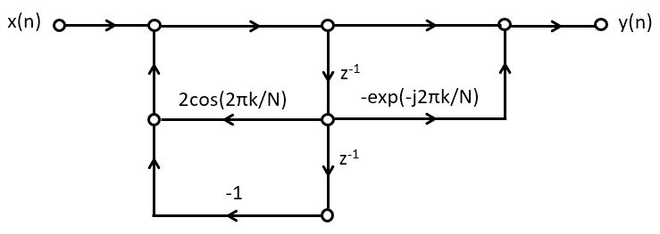

.. ECE 4703 

L10: Frequency Synthesis and Detection
======================================

The purpose of this lecture is as follows.

* To discuss the role of frequency synthesis and detection in digital communication systems
* To describe a design for a flexible frequency synthesis system, based on Direct Digital Frequency Synthesis (DDFS) and the CORDIC algorithm
* To describe a design for a flexible frequency detection system, based on the Goertzel algorithm for frequency detection
* To describe Audio Frequency Shift Keying as an example digital communication system

What is Frequency Synthesis and Detection?
^^^^^^^^^^^^^^^^^^^^^^^^^^^^^^^^^^^^^^^^^^

Digital communication is an important subfield of DSP - if not the main subfield. A digital communication
system transmits discrete messages from a sender to a received over an analog medium, typically wireless.
As part of the transmission, each message is converted into one or more symbols, who are then *modulated* into an analog waveform suitable for transmission over the medium. At the receiver side, the waveforms
are de-modulated back into symbols, which allow to reconstruct the discrete message. The modulation process is typically done in two steps. First, a *pulse modulation* process converts discrete symbol
pulses into a sampled-data waveform. Next, a *bandpass modulation* process modulates a carrier
frequency using the sample-data waveform. 

.. figure:: images/digicom.jpg
   :figwidth: 600px
   :align: center

There are many different techniques to implement
pulse modulation and bandpass modulation, and an in-depth discussion of them is out of scope for
this course.  However, each of the building
blocks in a digital communications system is a DSP design problem in its own. Pulse modulation, for example, which converts symbols into a bandwidth-limited waveform, can be implemented using digital FIR filters. At the receiver side, the symbol detection process converts the same bandwidth-limited waveform
back into symbols, and that process too, can be described as a digital FIR filtering problem.

In  this lecture, we will specific describe the process of Frequency Synthesis and Frequency Detection,
two operations that can be found back in nearly every digital communications system. Frequency synthesis
is often used during bandpass modulation and demodulation; while frequency detection is often found
as a mechanism for symbol detection.

.. important::

   **Frequency Synthesis** is the problem of generating a periodic waveform in real time, which
   a selected frequency, phase and amplitude. We are specifically interested in the case
   of sine and cosine generation.

   **Frequency Detection** is the problem of recognizing that a given signal has a frequency
   component of selected frequency at a power level higher than a given threshold level.

We will describe one technique for frequency synthesis as well as one technique for frequency detection. Eventually, we will describe a more complete digital communications system called Audio Frequency Shift Keying, as an application for Frequency Synthesis and Frequency Detection.

Direct Digital Frequency Synthesis
^^^^^^^^^^^^^^^^^^^^^^^^^^^^^^^^^^

A *Direct Digital Frequency Synthesis* (DDFS) system supports the generation of a periodic sine 
waveform of a selected frequency. It consists of a phase generator that drives a phase-to-waveform
converter. The phase quantizer is an optional block that reduces the number of phase bits and as
such can reduce the complexity of the phase-to-waveform process.

Phase Generator
"""""""""""""""

The phase generator is an N-bit accumulator ACC that is incremented with a given increment
DINC, an integer number. The increment operation is done at the rate of the sample frequency :math:`F_s`. Assuming that a full circle angle (:math:`2\pi`) is represented as an integer with :math:`2^N` bits, then the frequency of the output waveform :math:`F_o < F_s` corresponding to an increment DINC is given by the following expression.

.. math::

	F_o = \frac{F_s}{2^N} DINC

For a given target output frequency :math:`F_o`, the required phase increment DINC is computed as follows.

.. math::

	DINC = \lfloor \frac{F_o 2^N}{F_s} + 0.5 \rfloor

Since the smallest DINC is 1, it follows that the lowest output frequency that can be generated
by the DDFS system is given by the following expression.

.. math::

	F_{o,min} = \frac{F_s}{2^N} 

All frequencies generated are multiples of the lowest output frequency :math:`F_{o,min}`. The highest
output frequency that can be generated is of course the Nyquist frequency :math:`\frac{F_s}{2}`. In practice, the output frequency is limited to :math:`\frac{F_s}{4}` to reduce the complexity of the
reconstruction filter used at the output of the phase-to-waveform generator.
The number of bits :math:`N` therefore defines the frequency step :math:`F_{o,min}` of the DDFS. 
:math:`N` can be directly computed as follows.

.. math::

	N = \lceil log_2 (\frac{F_s}{F_{o,min}}) \rceil 

For example, with a system with :math:`F_s = 16KHz` and a desired resolution of 100Hz, we need an :math:`N` of at least 8 bits.

Waveform Generator
""""""""""""""""""

.. note::

   The example code of this section is included in the repository
   from this lecture as ``dsp_l10_cosperf``

With the phase captured in ACC, we then have to produce a sine (or cosine) function 
corresponding to :math:`sin(2\pi\frac{ACC}{2^N})`. In practice, the sine function is not
computed in real time, because it is too compute intensive. For example, even a simple
cosine as in the following function requires 3531 cycles on an ARM Cortex M4. 
Real-time computation of trigonometric functions is therefore always specialized.

.. code::

   int k=0;
   uint16_t processSample(uint16_t s) {
       float32_t phase = (2.0 * M_PI / 1024.0) * k;
       k = (k + 1) & 1023;
       return f32_to_dac14(0.1 * cos(phase));
   }

The most common form of specialization is to use a lookup table with :math:`2^N` pre-computed
values. The values are stored at a precision of M bits, so that a :math:`2^N \times M` bit lookup table is needed. In case :math:`2^N` is very large, the lookup table with sine values will be large as well. For those cases, the phase may have to be quantized to a lower resolution before table lookup.

The quantization of the phase to :math:`P` on the one hand, and the quantization of the amplitude to :math:`M` bits on the other hand, each result in additional quantization noise.

* Quantization of the phase results in phase noise and a spectral effect known as *spurs*, additional peaks that appear at a non-linear relationship to the original waveform.

* Quantization of the amplitude results in quantization noise, an overall increase of the noise floor of the output signal.

Without going into a detailed noise analysis, we will only make the following qualitative observation: *the number of bits P to represent the phase must be approximately equal to
the number of output bits M to represent the output signal*. If :math:`P << M`, the quantization noise in the system will be dominated by phase noise, and the additional resolution at the output is wasted. If :math:`M << P`, the quantization noise in the system
will be dominated by amplitude quantization noise, and the additional precision to represent
the phase is wasted.

.. note::

   The example code of this section is included in the repository
   from this lecture as ``dsp_l10_cosspurs``

The following program let's you experiment with the effect of quantization noise and phase noise. By default, phase is quantization on 10 bits, and the amplitude on 15 fractional bits.
By changing the macros ``PHASEQ`` and ``COSBITS`` you can investigate the impact of phase noise and amplitude noise on the output spectrum.

.. code::

   // sets the phase resolution (2^P with P ~ number of bits in phase)
   #define PHASEQ 1024
   
   // sets the frequency step (2^N with N ~ number of bits in accumulator)
   #define STEPQ 1024
   
   // sets the ouput resolution (M ~ number of bits in output, 1 .. 15)
   #define COSBITS 15
   
   int coslu[PHASEQ];
   void initcoslu() {
       int i;
       for (i=0; i<PHASEQ; i++)
           coslu[i] = ((int) (0.1 * cosf(2 * M_PI * i / PHASEQ) * (1 << COSBITS))) << (15 -    COSBITS);
   }
   
   int k=0;
   uint16_t processSample(uint16_t s) {
       float32_t phase = (2.0 * M_PI / STEPQ) * k;
       k = (k + 100) & (STEPQ - 1);
       return q15_to_dac14(coslu[k / (STEPQ/PHASEQ)]);
   }

   DDFS Spectrum for output Amplitude 15 fractional bits, Phase 10 bits

   DDFS Spectrum for output Amplitude 7 fractional bits, Phase 10 bits

.. figure:: images/spectrum_a15_p5.jpg
   :figwidth: 600px
   :align: center

   DDFS Spectrum for output Amplitude 15 fractional bits, Phase 5 bits

Frequency Synthesis in action: Audio Frequency Shift Keying
^^^^^^^^^^^^^^^^^^^^^^^^^^^^^^^^^^^^^^^^^^^^^^^^^^^^^^^^^^^

Among the many digital modulation formats available, one stands out because of its simplicity and its compatibility with audio-band signal modulation: Audio Frequency Shift Keying or AFSK. AFSK is widely used in amateur radio (as the physical layer for the AX.25 packet radio protocol) and for NOAA weather radio.

In AFSK1200, symbols are encoded at a rate of 1200 symbols per second. Each symbol is either a mark ('1') or else a space ('0'). Each symbol is modulated using frequencies at 1200Hz (mark frequency) or at 2200Hz (space frequency). A mark symbol is send as a mark frequency for a duration of one symbol period; a space symbol is send as a space frequency for a duration of one symbol period. Each mark symbol lasts of exactly one period at the mark frequency. Each space symbol lasts for 1.83 periods of the space frequency. 

AFSK modulation needs to have continuous phase, so that the transition between AFSK symbols is smooth (i.e., does not have sudden jumps). This ensures that the bandwidth of the resulting signal remains narrow. The AFSK modulation signal is generated as follows.

.. math::

   s(t) = cos( 2 \pi f_c t + 2 \pi \Delta f \int_0^t m(\tau) d \tau )

For AFSK1200, :math:`f_c = 1700 Hz` and `\Delta f = 500 Hz`. The symbols are encoded as :math:`m(\tau) = 1` for a space symbol and :math:`m(\tau) = -1` for a mark symbol. The instantaneous frequency of this signal is given by the following expression.

.. math::

   f &= \frac{d}{dt} (2 \pi f_c t + 2 \pi \Delta f \int_0^t m(\tau) d \tau) \\
     &= 2 \pi f_c + 2 \pi \Delta f m(t)

So that the instantanous frequency is indeed either 1200Hz or else 2200Hz.

AFSK modulator
""""""""""""""

.. note::

   The example code of this section is included in the repository
   from this lecture as ``dsp_l10_afsk_modulator``

An AFSK modulator can be implemented using the same technique as a DDFS: select a phase increment that is proportional to the mark or space frequency, and then generate the selected frequency for the period of a single symbol.

The following function shows the core of the AFSK modulator. 

.. code::

   int next_sample(int start, int stop) {
       samplectr = samplectr + 1;
   
       if (samplectr == SS) {
           currentsymbol = next_symbol(start, stop);
           samplectr = 0;
       }
   
       angle = angle + 2*(CFS + GFS * currentsymbol);
       angle = (angle > (1 << 16)) ? angle - (1 << 16) : angle;
   
       int mycos = coslu[angle >> 8];
   }

The following are relevant variables in this code:

* ``angle`` is the DDFS phase as a 15-bit number. A full circle (:math:`2 \pi`) equals :math:`2^{16}.

* ``samplectr`` counts the samples in a symbol, from 0 to ``SS - 1``.

* ``CFS`` is the 1700Hz center frequency scaled according to the sample frequency, and expressed as a DDFS increment. In this design we are using a 24KHz sample frequency, so that ``CFS`` equals ``(int) ((CENTER / FS) * (1 << 15))``.

* ``GFS`` is the 500Hz gap frequency scaled according to the sample frequency, and expressed as a DDFS increment. ``GFS`` equals ``(int) ((GAP / FS) * (1 << 15))``.

* ``nextsymbol`` is a function that returns the next symbol to be modulated, either a mark or a space.

* ``coslu`` is a lookup table with cosine values (encoded as Q15 numbers). ``angle >> 8`` goes from 0 to 255, corresponding to an angle 0 to :math:`2 \pi`.
 
The cosine table is a straightforward mapping of a single cosine period. In a resource-constrained environment (low on memory), we would have to apply additionaal
optimization techniques, such as exploiting the symmetry of the wave. A good overview
of such optimization techniques `can be found online <https://www.stepfpga.com/doc/_media/dsp_dds1.pdf>`_.

.. code::

   int coslu[256];
   void initcoslu() {
       int i;
       for (i=0; i<256; i++)
           coslu[i] = (int) (0.1 * cosf(2 * M_PI * i / 256.0) * (1 << 15));
   }

The ``next_symbol`` function depends on the information source.
In this example, we use finite state machine (FSM) that emits a steady stream of space symbols until the left button of the board (tied to ``start``) is pressed. Then, the FSM goes through a 'training' sequence of alternating mark and space symbols, and finally ends up generating a stream of random symbols. Pressing the right button (tied to ``stop``) returns the FSM to its initial state.

.. code::

   int next_symbol(int start, int stop) {
       enum {IDLE, TRAINING, ACTIVE};
       static int state = IDLE;
       static int trainingctr = 0;
       switch (state) {
       case IDLE:
           if (start != 0) {
               state = TRAINING;
               trainingctr = 0;
           }
           return -1;
           break;
       case TRAINING:
           trainingctr = trainingctr + 1;
           if (trainingctr < TRAININGLEN)
               return 1;
           else if (trainingctr < TRAININGLEN)
               return ((trainingctr - TRAININGLEN/2) % 2) * 2 - 1;
           else {
               state = ACTIVE;
               return ((trainingctr - TRAININGLEN/2) % 2) * 2 - 1;
           }
           break;
       case ACTIVE:
           if (stop != 0) {
               state = IDLE;
           } else if (start != 0) {
               state = TRAINING;
           }
           return rand_symbol();
           break;
       }
   }

   Spectrum and time-domain representation of an AFSK modulated stream of random symbols. The cursors are set at the mark and space frequencies (1200Hz and 2200Hz). Note that, due to the use of a DDFS, the time-domain waveform appears continuous.

Frequency Detection: Goertzel Algorithm
^^^^^^^^^^^^^^^^^^^^^^^^^^^^^^^^^^^^^^^

Digital Communication Systems frequently have to detect the presence of specific frequencies.
While it is possible, in principle, to compute the spectrum of a signal (for example using the
Fast Fourier Transform) and then select exactly the frequency component of interest, this
method is computationally too expensive and wasteful. Instead, we need a method that
can be tuned for a specific frequency.

The Goertzel filter is a filter with two poles (a complex conjugate pole pair) and one zero,
defined by the following equation.

.. math::

   H(z) = \frac{1 - e^{-j 2 \pi k / N}z^{-1}}{ 1 - 2 cos(2 \pi k/N) z^{-1} + z^{-2}}

The numerator, :math:`1 - 2 cos(2 \pi k/N) z^{-1} + z^{-2}`, is an expression we've encountered
before while discussing frequency-sampling FIR. This specific structure is a resonator: it
has a complex conjugate pole pair at an angle of :math:`\pm 2\pi k/N`. The zero of :math:`H(z)`
will cancel the pole at angle :math:`- 2\pi k/N`, so that :math:`H(z)` could be simplified as follows.

.. math::

   H(z) = \frac{1}{1 - e^{j 2 \pi k / N}z^{-1}}

.. figure:: images/goertzelzplane.jpg
   :figwidth: 300px
   :align: center

The expression for H(z) corresponds to a filter with an impulse response given by:

.. math::

   h(n) = u(n) . e^{-j 2 \pi k.n / N}

The filtering of an input signal :math:`x(n)` with :math:`h(n)` yields, at time :math:`n = N`, the output  of the DFT at frequency  :math:`2 \pi k/N`. A Goertzel filter is this capable of computing the DFT for one particular frequency, namely the frequency we wish to detect.

Goertzel Filter Implementation
""""""""""""""""""""""""""""""

Goertzel filters are realized as second-order biquad sections.

For frequency detection purposes, we're interested in the power present at a particular frequency; when the power level is below a given threshold will conclude that the frequency is 'absent', while when the power level is above that threshold, we'll say the frequency is 'present'.

From the filter structure, we can derive the following expression for :math:`y(n)`, with :math:`s(n)` the input of the first filter tap and :math:`s(n-1)` the input of the second filter tap.

.. math::

   y(n) = s(n) - s(n-1) . e^{-j 2 \pi k / N}

Delaying everything by one cycle, we find

.. math::

   y(n-1) = s(n-1) - s(n-2) . e^{-j 2 \pi k / N}

On a steady-state signal, the power in :math:`y(n)^2` will be the same as 
the power in :math:`y(n-1)^2`. Therefore,
to find the power in :math:`y(n)^2` we compute the following expression.

.. math::

   y(n-1)^2 = s(n-1)^2 + s(n-2)^2 - 2cos(2 \pi k / N).s(n-1).s(n-2)

We are now ready to define a practical use case of the Goertzel algorithm.

Goertzel algorithm
""""""""""""""""""

Goertzel filters are not regular steady-state filters. Similar as with a DFT, they
are computed over a window of N samples. The bigger the window, the higher the
frequency resolution of the power measurement. The following steps, known as the Goertzel 
algorithm, describe how
to compute the power in a signal at a given frequency :math:`f_{detect}`.

1. Select a frequency to detect, :math:`f_{detect} < f_{sample}`.
   Select a window of samples N over which the Goertzel filter will be applied. 

2. Compute the filter coefficient :math:`C = 2.cos(2.pi.f_{detect}/f_{sample})`.

3. Reset the filter taps :math:`s(n-1) = s(n-2) = 0`.

4. For N samples, compute :math:`s(n) = x(n) + C . s(n-1) . s(n-2)`.

5. After N samples, compute the power as :math:`s(n-1) . s(n-1) + s(n-2) . s(n-2) - C . s(n-1) . s(n-2)`.

Frequency Detection in action: DTMF Decoding
^^^^^^^^^^^^^^^^^^^^^^^^^^^^^^^^^^^^^^^^^^^^

.. note::

   The example code of this section is included in the repository
   from this lecture as ``dsp_l10_dtmf``

Goertzel filters are commonly used for DTMF decoding - the tones that you can hear when you press the keypad of a telephone. Each key is mapped to two frequencies, according to the following table.

   +----------------+-----------------+------------------+----------------+
   |                |   1209 Hz       |   1336 Hz        |  1477 Hz       |
   +================+=================+==================+================+
   | **697 Hz**     |    1            |    2             |   3            |
   +----------------+-----------------+------------------+----------------+
   | **770 Hz**     |    4            |    5             |   6            |
   +----------------+-----------------+------------------+----------------+
   | **852 Hz**     |    7            |    8             |   9            |
   +----------------+-----------------+------------------+----------------+

A DTMF decoder for the 9 numerical keys of a touch-tone telephone thus requires six goertzel filters, one for each frequency. If we run a DSP algorithm at 8000 Hz sample rate, then 256 samples will cover 32 ms, or 22 periods of the lowest frequency and 47 periods of the highest frequency. 

The following program illustrates a DTMF decoder. We include a data structure to capture the state of a single Goertzel filter, and then replicate it for each frequency that we need to decode. The ``FRACBITS`` macro is the number of fractional bits used in the design.

.. code ::

   typedef struct {
       int coef;
       int s2, s1;
   } Gtap;
   
   Gtap t697;
   Gtap t770;
   Gtap t852;
   Gtap t1209;
   Gtap t1336;
   Gtap t1477;
   
   void initgtap() {
       t697.coef  = (int) (cosf(2 * M_PI *   697 / FS) * 2 * (1 << FRACBITS));
       t770.coef  = (int) (cosf(2 * M_PI *   770 / FS) * 2 * (1 << FRACBITS));
       t852.coef  = (int) (cosf(2 * M_PI *   852 / FS) * 2 * (1 << FRACBITS));
       t1209.coef = (int) (cosf(2 * M_PI *  1209 / FS) * 2 * (1 << FRACBITS));
       t1336.coef = (int) (cosf(2 * M_PI *  1336 / FS) * 2 * (1 << FRACBITS));
       t1477.coef = (int) (cosf(2 * M_PI *  1477 / FS) * 2 * (1 << FRACBITS));
   }

Using the ``Gtap`` record, we then implement the Goertzel filter functionality. `` samplegoertzel`` updates the filter state with a new sample, ``resetgoertzel`` clears the filter state, and ``powergoertzel`` computes the power of the filtered output signal. All of these functions are derived from our earlier analysis.

.. code::

   void samplegoertzel(Gtap *t, int x) {
       int s0;
       s0    = x + FIXMUL(t->s1, t->coef) - t->s2;
       t->s2 = t->s1;
       t->s1 = s0;
   }
   
   void resetgoertzel(Gtap *t) {
       t->s1 = 0;
       t->s2 = 0;
   }
   
   int powergoertzel(Gtap *t) {
       return (FIXMUL(t->s1, t->s1) +
               FIXMUL(t->s2, t->s2) -
               FIXMUL(FIXMUL(t->coef, t->s1), t->s2));
   }

Next, to decode DTMF signals, we have to run six Goertzel filters in parallel. When decoding the power output, we are looking for two filters with an above-threshold output, representing the column and row of the pressed key. The ``PTHRESHOLD`` macro is an experimentally derived constant, equal to 1000 in the example.

.. code::

   void dtmfreset() {
       resetgoertzel( &t697);
       resetgoertzel( &t770);
       resetgoertzel( &t852);
       resetgoertzel(&t1209);
       resetgoertzel(&t1336);
       resetgoertzel(&t1477);
   }
   
   void dtmfaddsample(int x) {
       samplegoertzel( &t697, x);
       samplegoertzel( &t770, x);
       samplegoertzel( &t852, x);
       samplegoertzel(&t1209, x);
       samplegoertzel(&t1336, x);
       samplegoertzel(&t1477, x);
   }
   
   // #define DTMFDEBUG
   
   int dtmfdecode() {
       unsigned p697  = powergoertzel(  &t697);
       unsigned p770  = powergoertzel(  &t770);
       unsigned p852  = powergoertzel(  &t852);
       unsigned p1209 = powergoertzel( &t1209);
       unsigned p1336 = powergoertzel( &t1336);
       unsigned p1477 = powergoertzel( &t1477);
   
   #ifdef DTMFDEBUG
       printf("%5d %5d %5d %5d %5d %5d\n", p697, p770, p852, p1209, p1336, p1477);
   #endif
   
       int d697  = (p697  > PTHRESHOLD);
       int d770  = (p770  > PTHRESHOLD);
       int d852  = (p852  > PTHRESHOLD);
       int d1209 = (p1209 > PTHRESHOLD);
       int d1336 = (p1336 > PTHRESHOLD);
       int d1477 = (p1477 > PTHRESHOLD);
   
       // - if three or more thresholds are exceeded,
       //   we will reject this as valid dtmf, it's
       //   noise or a background sound
       // - if two thresholds are exceeded, we try to
       //   decoded as a valid dtmf combination
       // - in all other cases, we reject this tone
   
       if ((d697 + d770 + d852 + d1209 + d1336 + d1477) >= 3)
           return -1;
       else if (d852 && d1477)
           return 9;
       else if (d852 && d1336)
           return 8;
       else if (d852 && d1209)
           return 7;
       else if (d770 && d1477)
           return 6;
       else if (d770 && d1336)
           return 5;
       else if (d770 && d1209)
           return 4;
       else if (d697 && d1477)
           return 3;
       else if (d697 && d1336)
           return 2;
       else if (d697 && d1209)
           return 1;
   
       return -1;
   }

Finally, the integrate the DTMF decoder in an interrupt driven DSP system, blocks of 256 samples are fed into the DTMF decoder, and each time a new output is detect, the decoded value is printed. This example code returns the value sampled by the microphone, so when you run this code **you should turn down the volume to avoid feedback**.

.. code::

   int samplectr = 0;
   #define GWINDOW 256
   int lastdtmf = -1;
   
   uint16_t processSample(uint16_t s) {
       int x = adc14_to_q15(s);
   
       samplectr = (samplectr + 1) % GWINDOW;
   
       if (samplectr == 0) {
           int newdtmf = dtmfdecode();
           if (newdtmf != lastdtmf)
               printf("%d\n", newdtmf);
           lastdtmf = newdtmf;
           dtmfreset();
       } else
           dtmfaddsample(x >> (15 - FRACBITS));
   
       return q15_to_dac14(x); // silence
   }
   
   int main(void) {
       WDT_A_hold(WDT_A_BASE);
   
       initgtap();
       dtmfreset();
   
       msp432_boostxl_init_intr(FS_HZ, BOOSTXL_MIC_IN, processSample);
       msp432_boostxl_run();
   
       return 1;
   }

.. figure:: images/dtmfexample.jpg
   :figwidth: 600px
   :align: center

   Spectrum and time-domain representation of a DTMF signal corresponding to keypad number '4'. The markers are located at about 770Hz and 1209 Hz.

Conclusions
^^^^^^^^^^^

We discussed two concepts that are important in the implementation of digital communication systems: frequency synthesis and frequency detection.
The AFSK modulator, described in the first half of the lecture, will be used in the coming lab (Lab 6) which will address AFSK demodulation.
