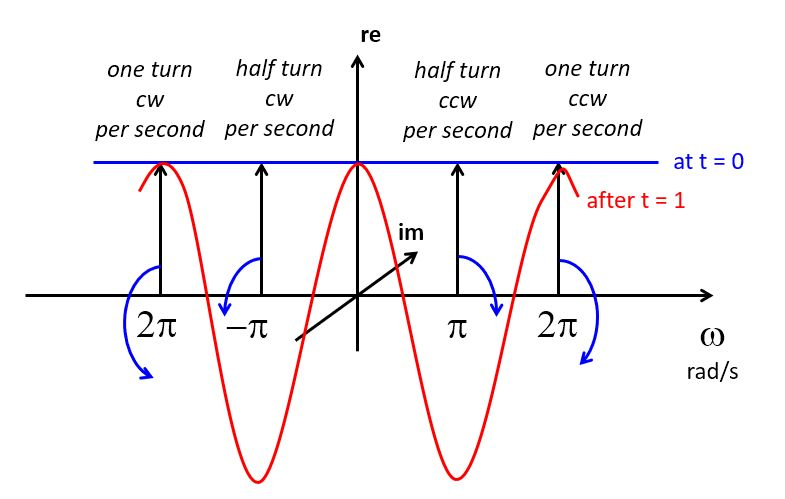
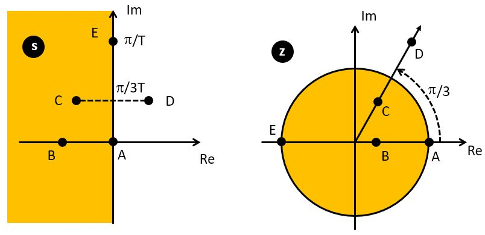
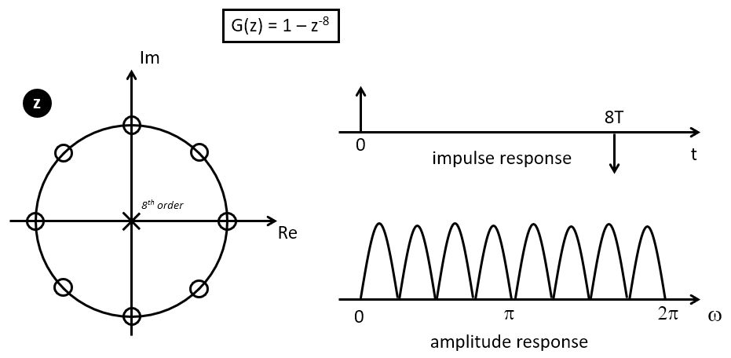
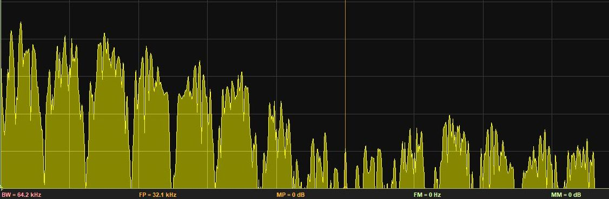
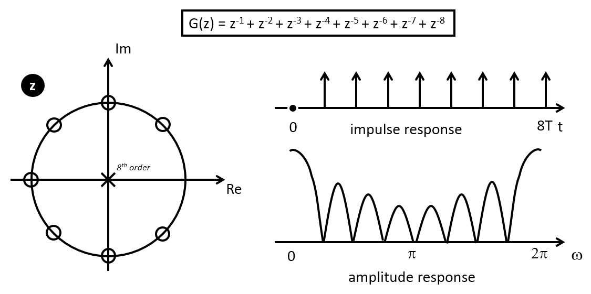
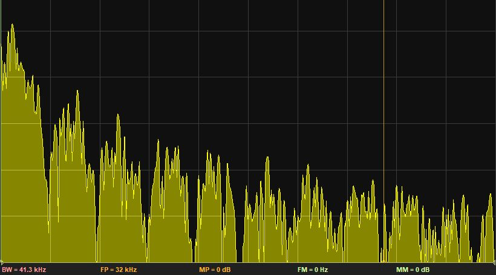

.. ECE 4703 

L3: DTFT, z-transform, and FIR filters
======================================

The purpose of this lecture is as follows.

* To review the fundamentals of the DTFT and its relation to discrete-time signal processing
* To review the fundamentals of the Z-transform
* To review frequency response analysis using the Z-transform
* To introduce FIR filter structures by means of examples

Signal Processing is Stream Processing
^^^^^^^^^^^^^^^^^^^^^^^^^^^^^^^^^^^^^^

Last lecture, we discussed the nature of real-time implementation for DSP. In a real-time DSP
system, every sample period, a new signal sample is presented to the DSP algorithm. 
The DSP algorithm then must take this signal sample and compute an output sample before the 
next input sample arrives. We talked about three different software mechanisms
to achieve this real-time constraint: (a) polling-driven processing, (b) interrupt-driven 
processing, and (c) DMA-driven processing.

DSP algorithms are algorithms designed to compute on an infinite stream of samples.
Due to the real-time nature of the DSP processing, these samples are spaced :math:`T_s` apart in time.
A DSP algorithm describes the output as a function of the previous :math:`N` input samples, and
the previous :math:`M` computed outputs. Of course, :math:`1 < N, M < \infty`.

.. figure:: images/streamingprocessing.jpg
   :figwidth: 600px
   :align: center

As time progresses, the DSP algorithm computes a stream of output samples from a stream of input
samples. The implementation must handle not only the computations (ie. computing a new output from
the previous inputs and previous outputs), but it must *also* handle the storage of those samples.

For example, if :math:`N=3, M=4`, then a DSP algorithm for the design shown in the figure 
could be a C function similar to the following.

.. code:: c
   :number-lines: 1

   void dsp(input x2,   // input 2 samples ago 
            input x1,   // input 1 sample ogo
            input x0,   // input @now
            output y3,  // output 3 samples ago
            output y2,  // output 2 samples ago
            output y1,  // output 1 sample ago
            output *y0) // output @now 

However, this is only part of the tasks of a streaming DSP implementation in C.
When the next input sample arrives, the DSP implementation must relabel the inputs and
outputs: the @now input `x0` and output `y0` becomes the input `x1` and output `y1` of 
one sample ago; the input `x1` and output `y1` of one sample ago becomes the input `x2` 
and output `y1` of two samples ago; and so forth. For each new input sample, we have to 
process a *tick* function that handles this streaming.
For example:

.. code:: c
   :number-lines: 1

   int x0, x1, x2;
   int y0, y1, y2, y3;

   void tick() {
     // shift the input stream
     x2 = x1;
     x1 = x0;
     x0 = adc_output();

     dsp(x2, x1, x0, y3, y2, y1, &y0);

     // shift the output stream (for next sample)
     y3 = y2;
     y2 = y1;
     y1 = y0;

     dac_input(y0);
   }

Hence, when you develop a DSP implementation, you have to think about both the algorithm (e.g., filter) 
design, as well as the stream processing.
Your DSP implementation works with a very special data structure, a *stream*. Since C compilers
don't have a stream datatype, you have to program the stream behavior as part of the
DSP algorithm implementation.

The Discrete Time Fourier Transform
^^^^^^^^^^^^^^^^^^^^^^^^^^^^^^^^^^^

The Dirac Impulse
"""""""""""""""""

We will recap some of the basic properties of the
spectra of discrete-time signals. Consider the basic Dirac pulse :math:`\delta(t)` 
at time :math:`t=0`. The spectrum of this pulse is given by the Fourier Transform:

.. math::

  G(j\omega) = \int_{-\infty}^{\infty} \delta(t).e^{-j\omega t}.dt = e^{-j 0} = 1

The spectrum of an impulse contains *every* frequency under the sun. Furthermore,
the magnitude and the phase of :math:`G(j\omega)` have a particular format.

.. math::
  | G(j\omega) |    &= 1 \\
  phase(G(j\omega)) &= 0

The amplitude of every phasor making up :math:`G(j\omega)` is
uniform, and they are all aligned with each other (at t=0). It is this alignment that causes such
a sharp impulse to appear in the time domain. 

At any time besides t=0, the combination of frequencies in :math:`G(j\omega)` will cancel each other out,
so that the time-domain value of :math:`\delta(t) = 0 \leftrightarrow t \neq 0`.

To see why, consider the behavior of the spectrum, as in the following picture.
Since :math:`G(j\omega) = 1`, each frequency contains a phasor of unit length. As time progresses, all of these phasors start to rotate at the speed corresponding to its frequency. 
When :math:`\omega` is positive, they rotate
counter-clockwise. When :math:`\omega` is negative, they rotate clockwise. 

The reponse of the function in the time domain is the sum of all these phasors.
At time zero, all phasors (at every frequency) are aligned with the real axis, and 
pointing upward. This makes :math:`\delta(0)` an infinitely high and infinitely narrow pulse with area 1.
If time advances one second, the phasors will rotate. After one second, the
phasor at :math:`\omega = \pi` has made a half turn, while the phasor at :math:`\omega = 2\pi` has made a
full turn. The time domain response at time = 1 will be zero, since as the sum of all phasors (over all :math:`\omega`) cancels out to 0. This is true for every :math:`t = T`, since it is always possible to find
a frequency :math:`\omega = 2 \pi / T` that has made a full turn at that moment, thereby cancelling out
the response of frequencies between DC and :math:`\omega = 2 \pi / T`.

The time-shifted Dirac Impulse
""""""""""""""""""""""""""""""

Next, consider the spectrum of a Dirac pulse at a time different from zero, say  :math:`\delta(t - T)` for a 
Dirac pulse at time :math:`T`. Clearly, this pulse must also contain the same frequency components as :math:`\delta(t)`. The only difference is that :math:`\delta(t - T)` has shifted over time :math:`T`, which will induce a delay for all of these frequency components. The spectrum is now given by:

.. math::

  G(j\omega) = \int_{-\infty}^{\infty} \delta(t-T).e^{-j\omega t}.dt = e^{-j \omega T}

The term :math:`e^{-j \omega T}` still has unit magnitude for all frequencies, but there is a phase shift
of :math:`-\omega T` radians for the phasor at frequency :math:`\omega`. 

The makes the term :math:`e^{-j \omega T}` pretty important. This term describes the spectrum of a pulse delayed by time T. When we think of a sampled-data signal as a sequence of weighted pulses, we can thus construct the spectrum of the sampled-data signal by summing up the contribution of each pulse individually. Since the complete sampled data signal is a linear combination of weighted time-delayed pulses, the spectrum of a sampled data signal is a linear combination of the spectrum of these individual pulses.

Indeed, let's say that you have a sampled-data signal :math:`x(n)`. 
Then the signal can be written in the time domain
as :math:`x_s(nT_s)` as follows:

.. math::

   x_s(nT_s) = x_0 . \delta(t) + x_1 . \delta(t - T_s) + x_2 . \delta(t - 2.T_s) + ...

Now, making use of the linear property in frequency analysis, we can express the spectrum of :math:`x_s(nT_s)` as
the sum of the spectra caused by each single sample pulse. Mathematically:

.. math::

   X_s(j\omega) = x_0  + x_1 . e^{-j\omega T_s} + x_2 . e^{-j\omega 2.T_s}  + ...

This is quite cool: you can describe the frequency spectrum of a sampled-data signal simply by looking at the sampled-data values! This transformation also demonstrates that the spectrum of a sampled-data signal is periodic,
since :math:`e^{-j\omega T_s}` is periodic. In particular, the period is :math:`2 \pi / T_s`. Indeed, recall from Lecture 1 that the spectrum of a sampled data signal contains infinitely many copies
of the spectrum of the baseband signal. When the baseband signal has no components below frequency :math:`\pi / T_s`, then the baseband signal can be perfectly recreated from the sampled-data signal.

The Discrete Time Fourier Transform
"""""""""""""""""""""""""""""""""""

The previous expression is very close in form to the Discrete Time Fourier Transform.

.. important::

  The Discrete Fourier Transform is the spectrum of a sample-data signal :math:`x(n)` given a 
  normalized sample period of :math:`T_s = 1`.

  .. math::

     X(e^{j\omega}) = \sum_{-\infty}^{\infty} x(n).e^{-jn\omega}

Here are some well-known DTFT pairs.

+-----------------------------------------+-----------------------------------------------------------------------+
|  Sequence                               | Discrete-Time Fourier Transform                                       |
+=========================================+=======================================================================+
| :math:`\delta(n)`                       | 1                                                                     |
+-----------------------------------------+-----------------------------------------------------------------------+
+ :math:`\delta(n-n_0)`                   | :math:`e^{-j.n_0.\omega}`                                             |
+-----------------------------------------+-----------------------------------------------------------------------+
|  1                                      | :math:`2\pi.\delta(\omega)`                                           |
+-----------------------------------------+-----------------------------------------------------------------------+
| :math:`e^{j.n.\omega_0}`                | :math:`2\pi.\delta(\omega - \omega_0)`                                |
+-----------------------------------------+-----------------------------------------------------------------------+
| :math:`cos(n.\omega_0)`                 | :math:`\pi.\delta(\omega + \omega_0) + \pi.\delta(\omega - \omega_0)` |
+-----------------------------------------+-----------------------------------------------------------------------+

The last formula, for :math:`cos(n.\omega_0)`, is somewhat particular, since for many sample sequences :math:`x(n)` it's
not easy to find a closed form. That brings us to the z-Transform.

The z-Transform
^^^^^^^^^^^^^^^

The z-transform is a generalization of the DTFT where we write a sampled-data sequence as a power series
in :math:`z`, where :math:`z = e^{sT} = e^{(\sigma + j.\omega).T}` has both real and imaginary components. 

The z-transform of a sampled-data signal becomes:

.. math::

  G(z) = x_0 + x_1.z^{-1} + x_2.z^{-2} + ...

When :math:`z` equals the imaginary term :math:`z = e^{j\omega}`, then :math:`G(z) = X(e^{j\omega})` as in the DTFT.
However, in contrast to the DTFT, the z-transform is better at handling long series :math:`x(n)` where summing
up  :math:`X(e^{j\omega})  = \sum_{-\infty}^{\infty} x(n).e^{-jn\omega}` is complicated. 

Here is an example. Suppose we have a unit step:

.. math::

  U(z) &= 1 + z^{-1} + z^{-2} + z^{-3} + ... 

Which is tricky to sum up using :math:`X(e^{j\omega})`, since the sum does not converge for :math:`omega = 0`.
In the z-transform expression, we can rewrite :math:`U(z)` as a power series. Namely

.. math::

  G(z) &= \frac{z}{z - \alpha} = 1 + \alpha.z^{-1} + \alpha^2.z^{-2} + \alpha^3.z^{-3} + ... \\
  G(z) &= \frac{1}{1 - \alpha.z^{-1}}  \leftrightarrow |z| > |\alpha|

Hence, the z-transform of the unit step can be written as

.. math::

  U(z) &= \frac{1}{1 - z^{-1}}

The choice of :math:`z` is inspired by the Laplace transform variable s. But unlike the Laplace transform,
the :math:`z` has built-in periodicity :math:`z = e^{sT + 2.\pi} = e^{sT}`.

The Unit Circle
"""""""""""""""

z-transform functions are commonly represented (and computed) on a unit circle presentation,
which reflects the periodic nature of :math:`z`. In fact, the z-plane (which contains the
unit circle) is the discrete-time equivalent of the s-plane for continuous-time functions.
The inside of the unit circle corresponds to the left side of the s-plane (stable side) while
the outside of the unit circle corresponds to the right side of the s-plane. The unit circle
itself maps to the frequency axis in the s-plane, and any feature in the z-plane at an angle :math:`\alpha`
will repeat forever in the s-plane at :math:`j\omega = (n.2\pi + \alpha)/T`.

The unit circle is used to plot the poles and zeroes of the z-transform transfer function. 
Consider for example the following z-transform function :math:`G(z)`, which has 8 zeroes and 8 poles.

.. math::

  G(z) = (1 - z^{-8}) = \frac{z^8 - 1}{z^8}

As an 8th order demoninator and nominator polynomial, this function has 8 zeroes and 8 poles.
The zeroes and poles are marked on the unit circle on the following figure. The zeroes are
the 8th order root of unity (i.e. all solutions to :math:`z^8 = 1`, which is :math:`z = e^{\frac{n.pi}{4}}` for :math:`n = 0 .. 7`).

The amplitude response is the magnitude response of G(z) while traveling along the unit circle. 
When we go through a zero, the response :math:`G(z)` is zero. 

The time domain impulse response can
be read directly from the z-transform :math:`1 - z^{-8}`. 
The time domain impulse response of G(z) is simply two pulses
of opposite sign space eight sample periods apart. 

The following C program verifies this 'Comb Filter'.

.. code:: c
   :number-lines: 1

   uint16_t processSample(uint16_t x) {
       static float32_t taps[9];
   
       // use this to create white noise
       float32_t input = adc14_to_f32(0x1800 + rand() % 0x1000);
   
       // use this to use a test signal
       // float32_t input = adc14_to_f32(x);
   
       uint32_t i;
       for (i=0; i<8; i++)
           taps[8-i] = taps[7-i];
       taps[0] = input;
   
       return f32_to_dac14(taps[0] - taps[8]);
   
       return x;
   }

By injecting white noise into the filter, and taking the spectrum of the output, we can observe the 8 lobes
of the frequency response. In the following graph, the central cursor line is at 32KHz, the sample frequency
of the DSP system. The 8 lobes can be counted between DC and 32KHz, but the spectrum is distored by zero-order
hold of the DAC.

FIR filters
^^^^^^^^^^^

The Comb filter we discussed while constructing the Unit Circle is an FIR design - a *Finite Impulse Response*
filter. This filter computes its output using only the past input values to the system.

The Z-transform of an FIR is a polynomial in :math:`z^{-1}`.

.. math::

  H(z) = \sum_{n=0}^{N} h(n) . z^{-n}

The sequence :math:`h(n)` is the *impulse response* of the FIR filter. This sequence is bounded.

The response of an FIR filter is computed by the discrete-time convolution of an input sequence :math:`x(n)` with
the impulse response :math:`h(n)`.

.. math::

  y(n) = \sum_{k=0}^{N} h(k) . x(n-k)

The classic **direct-form implementation** of an FIR filter is done by implementing a *tapped delay line*.
The following is an example of a third-order FIR filter. Such a filter would have three zeroes in the z-plane 
and three poles at :math:`z=0`.
It has 4 multiplications with coefficients, 3 additions, and three delays.

.. figure:: images/firdirect.jpg
   :figwidth: 600px
   :align: center

FIR Design Example
""""""""""""""""""

Let's look at another simple example of a FIR filter with the following impulse reponse:

 .. math::

  G(z) = z^{-1} + z^{-2} + z^{-3} + z^{-4} + z^{-5} + z^{-6} + z^{-7} + z^{-8}

Thus, the filter repeats on input pulse 8 times, starting with one sample delay.
This has an averaging effect. To find the zeroes and poles of this filter, note
that this FIR can be written as

 .. math::

  G(z) = \frac{z^{8} + z^{7} + z^{6} + z^{5} + z^{4} + z^{3} + z^{2} + z^{1}}{z^8}

And then you can use a root finding program to find the poles and zeroes of these
polynomials. In Matlab, for example, you can use `root([0 1 1 1 1 1 1 1 1])` to find
the location of these zeroes. Interestingly the zero locations are the same
as for the impulse response :math:`(1 - z^{-8})`, except for the zero at :math:`z = 1`.
With some extra sleuthing, you may be able to show that this averaging Z transform
:math:`G(z) = z^{-1} + z^{-2} + z^{-3} + z^{-4} + z^{-5} + z^{-6} + z^{-7} + z^{-8}` can
be converted into the comb filter by adding a zero at :math:`z = 1`.

We can then implement a program and measure the spectrum, to verify that this design,
indeed, has an averaging effect.
The following C program verifies this 'Averager'.

.. code:: c
   :number-lines: 1

   uint16_t processSample(uint16_t x) {
       static float32_t taps[9];
   
       // white noise
       float32_t input = adc14_to_f32(0x1800 + rand() % 0x1000);
   
       // test signal
       // float32_t input = adc14_to_f32(x);
   
       uint32_t i;
       for (i=0; i<8; i++)
           taps[8-i] = taps[7-i];
       taps[0] = input;
   
       // the filter. We're adding a scale factor to avoid overflow.
       float32_t r = 0.125f * (taps[1] + taps[2] + taps[3] + taps[4] + 
                               taps[5] + taps[6] + taps[7] + taps[8]);
   
       return f32_to_dac14(r);
   
       return x;
   }
 
The measured spectrum response confirms 8 lobes, with a big one around
DC.

Conclusions
^^^^^^^^^^^

We discussed (the meaning of) the spectrum of a Dirac impulse, and how this leads
to the Discrete Time Fourier Transform (DTFT). We then generalized the DTFT to
the z-transform and discussed common notation and presentation (polynomials,
unit filter).

We applied that knowledge to the design of FIR filters, and we created two FIR
filters: a comb filter, and an averaging filter. For both filters, we constructed
the zero/pole plot, the impulse response, and we measured the frequency response
using a C program.

We discussed the symmetrical property of linear-phase filters - which leads to
constant (group-)delay filters, as well as to optimized implementation.
In next lecture, we will dive deeper into the various FIR implementation
techniques (direct, transpose, lattice, ..) and their realization using Matlab
and C programming.

*Optional: Discuss Matlab filter design tools*

