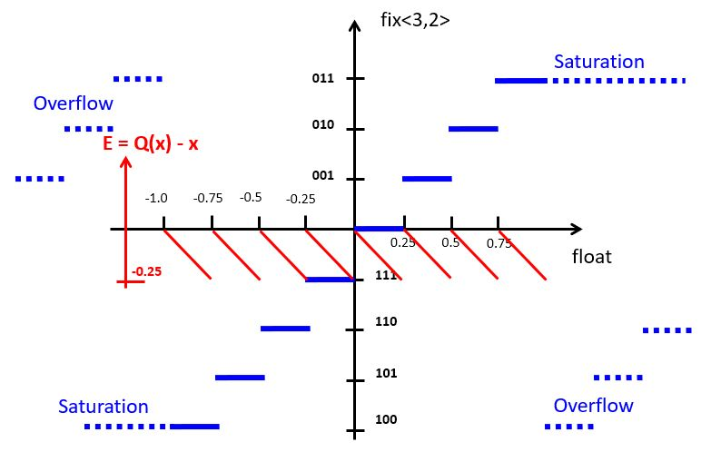

.. ECE 4703 

L6: Fixed Point Arithmetic in DSP
=================================

The purpose of this lecture is as follows.

* To describe fixed-point data representation of signals
* To describe arithmetic using fixed-point data representation
* To discuss the effects of fixed-point arithmetic on DSP
* To discuss the influence of coefficient quantization on digital filter
* To demonstrate the use of filter coefficient quantization in Matlab

Fixed Point Data Representation
^^^^^^^^^^^^^^^^^^^^^^^^^^^^^^^

Floating point representation is the default representation adopted in many scientific computations, as well as in the world of signal processing. Matlab, for example, will compute the filter coefficients by default in a double-precision (64-bit) precision. 

On the other hand, floating point representation expensive to implement. Since a floating point number is represented using a mantissa and an exponent, every arithmetic operation involving a floating point number implies operations on both the mantissa as well as the exponent. Furthermore, floating point numbers have to be aligned before every operation, and they have to be normalized after every operation. Floating point arithmetic has a high complexity, much larger than that of typical integer arithmetic.

In DSP processing applications, the increased complexity of floating point arithmetic will manifest itself in two areas.

* If the target processor includes floating-point hardware (such as the Cortex-M4F that we're using on our MSP432 experimentation board), then the use of floating point arithmetic - as opposed to integer arithmetic - will increase the power consumption of the processor. Further, when the floating point program is about as fast as the (equivalent) integer arithmetic program, then the energy consumption for the floating point program will be higher as well.

* If the target processor does not include floating-point hardware (for example, because it's a smaller microcontroller), then floating-point operations will have to be emulated in software, which will lead to a significant performance hit.

Therefore, to optimize the performance or the power/energy footprint of a program, DSP programmers are often required to optimize the cost of the arithmetic, by converting floating point arithmetic to integer arithmetic. We will discuss a method to achieve this optimization systematically, by converting the data types in a DSP program from floating-point data representation to **fixed-point data representation**. The conversion process from a DSP program using floating-point data types into a DSP program using fixed-point data types, is called **fixed-point refinement**.

Unsigned Fixed-point representation 
"""""""""""""""""""""""""""""""""""

Assume an unsigned integer datatype with bits :math:`b_{N-1} b_{N-2} ... b_2 b_1 b_0`. The value of the unsigned integer number is defined as follows.

.. math::

	V_{uint<N>} = b_{N-1} . 2^{N-1} + b_{N-2} . 2^{N-2} + ... + b_1 . 2 + b_0

In a fixed-point representation, the binary point shifts from the right-most position to a different position :math:`k`. Hence, a fixed-point representation is defined by the number of bits :math:`N` as well as the position of the binary point :math:`k`. For an unsigned number we adopt the notation ``ufix<N,k>``, where ``ufix`` means 'unsigned fixed-point'. An unsigned integer as defined above would be ``ufix<N,0>``.
The value of a fixed point number ``ufix<N,k>`` is computed as follows:

.. math::

	V_{ufix<N,k>} = b_{N-k-1} . 2^{N-k-1} + b_{N-k-2} . 2^{N-2} + ... + b_0 + b_{-1} . 2^{-1} + ... +  b_{k} . 2^{-k}

An ``ufix<N,k>`` fits in the same number of bits as an N-bit unsigned integer. The only difference lies in our interpretation of what these bits mean. The following is an example for a ``ufix<6,4>``. A given bit pattern
can be evaluated to the formulas above to compute the integer value as well as the fixed-point value.

There is a simple relationship between the value of an unsigned integer of N bits, and the value of an unsigned fixed point number ``ufix<N,k>``.

.. math::

	V_{uint<N>} &= V_{ufix<N,k>} . 2^k \\
	V_{ufix<N,k>} &= V_{uint<N>} . 2^{-k}

Signed Fixed-point representation 
"""""""""""""""""""""""""""""""""

Signed values in integer arithmetic are captured in one of three different ways. The most common method is two's complement, and we'll focus on this method. The two other methods are one's complement and sign-magnitude representation.

In a two's complement representation, the value of a signed integer ``int<N>`` is defined as follows.

.. math::

	V_{int<N>} = b_{N-1} . [-(2^{N-1})] + b_{N-2} . 2^{N-2} + ... + b_1 . 2 + b_0

Thus, the weight of the most significant bit is negative. Similarly, the value of a signed fixed-point number
``fix<N,k>`` is defined as follows.

.. math::

	V_{fix<N,k>} = b_{N-k-1} . [-(2^{N-k-1})] + b_{N-k-2} . 2^{N-2} + ... + b_0 + b_{-1} . 2^{-1} + ... +  b_{k} . 2^{-k}

Thus the only difference between signed and unsigned representation is the weight of the most significant bit (positive for unsigned, negative for signed two's complement.) The relationship between the value of the integer and fixed-point representation is the same as above:

.. math::

	V_{int<N>} &= V_{fix<N,k>} . 2^k \\
	V_{fix<N,k>} &= V_{int<N>} . 2^{-k}

Conversion from Floating Point to Fixed Point
"""""""""""""""""""""""""""""""""""""""""""""

N-bit fixed-point numbers can be conveniently represented as N-bit integers, 
and in a C program we will use integer data types (``int``, ``unsigned``) to
store fixed-point numbers. A floating-point number is converted to a fixed-point number by proper scaling and conversion to an integer data
type.

To convert a floating point number to fixed point, we first scale it by :math:`2^k` up so that the least significant fractional bit gets unit weight. This conversion can lead to precision loss (at the LSB side) and overflow (at the MSB side). The following program illustrates the conversion to a ``fix<8,6>`` datatype.

.. code::

    #include <stdio.h>
    
    void main() {
      float taps[5] = {0.1, 1.2, -0.3, 3.4, -1.5};

      int taps_8_6[5];    // a fix<8,6> type
      unsigned i;

      for (i=0; i<5; i++)
        taps_8_6[i] = (int) (taps[i] * (1 << 6));

      for (i=0; i<5; i++)
        printf("%+4.2f %10d\n", taps[i], taps_8_6[i]);
    }

The program generates the following output:

.. code::

   +0.10          6
   +1.20         76
   -0.30        -19
   +3.40        217
   -1.50        -96

The value of a ``fix<8,6>`` lies between -2 (for pattern 10000000)
and 1.984375 (for pattern 01111111), which corresponds to integer values -128 to 127. Hence, the floating value +3.40 has suffered overflow during the conversion; its integer value is 217.

In addition, some of the floating point
numbers (like 0.1) cannot be expressed exactly. Indeed, the value 6
maps to the bit pattern 00000110, or 0.09375. Hence, that conversion
suffered precision loss. 

Note that negative numbers are printed negative because of sign extension. For example, -19 corresponds to the bit pattern equals 1111...11101101. To lower 8 bits are 11101101, while the upper 24 bits are all 1, extending the sign bit of fix<8,6>.

Overflow is a highly non-linear effect with dramatic impact on the results of DSP computation. It must be detected (and prevented).

Conversion from Fixed Point to Floating Point
"""""""""""""""""""""""""""""""""""""""""""""

After computations in fixed point precision are complete, we can convert
back to a floating point representation, in order to obtain the numerical
result. The conversion will scale down the integer value of a fixed-point
number by a factor :math:`2^k`, so that the least significant bit gets
its actual weight. 

Special care has to be taken if the MSB of the fixed point representation is not located at the MSB of the integer representation. Indeed, we obtain the correct sign in the converted result, we have to replicate the MSB of the fixed point representation to get sign extension. The following program illustrates the conversion from a ``fix<8,6>`` datatype.

.. code::

    #include <stdio.h>
    
    void main() {
      int taps_8_6[5] = {6, 76, -19, 127, -96}; // a fix<8,6> type

      float taps[5];    // a fix<8,6> type
      unsigned i;

      for (i=0; i<5; i++)
          taps[i] = taps_8_6[i] * 1.0 / (1 << 6);

      for (i=0; i<5; i++)
        printf("%10d %+4.6f\n", taps_8_6[i], taps[i]);
    }

The program generates the following output:

.. code::

         6 +0.093750
        76 +1.187500
       -19 -0.296875
       127 +1.984375
       -96 -1.500000

Note that the fixed-point conversion introduces quantization which prevents  perfect reconstruction of the floating-point value. For example, float(0.1) can be converted to fix<8,6>(6), but the opposite conversion yields float(0.09375). 

Fixed Point Arithmetic
^^^^^^^^^^^^^^^^^^^^^^

Because fixed-point representation is so strongly related to integer representation, we are able to express arithmetic operations on fixed-point numbers in terms of integer operations. Let's first derive a few basic rules. We'll first make the derivation for unsigned numbers.

Addition
""""""""

When we add two ``ufix<N,k>`` numbers, then the result is an ``ufix<N+1,k>`` number. The extra bit at the MSB side is there to capture the carry bit, in case one is generated. The subtraction of two ``ufix<N,k>`` numbers uses the same rule, since the subtraction can be defined as the addition of a ``ufix<N,k>`` with the two's complement version of the other ``ufix<N,k>``.

When we add a ``ufix<N,k1>`` number to a ``ufix<N,k2>`` number, with k1 > k2, then the two numbers have to be aligned first. This will increase the wordlength of the sum with ``k1 - k2`` bits. However, if we desire to capture the sum as an ``N+1`` bit number, then there are two possible alignments. 

1. For a ``ufix<N+1,k1>`` sum, we will have to increase the number of ``ufix<N,k2>`` fractional bits with a left-shift before addition. 

2. For a ``ufix<N+1,k2>`` sum, we will have to decrease the number of ``ufix<N,k1>`` fractional bits with a right-shift before addition. 

Since the total sum has only ``N+1`` bits, there is potential precision loss, as illustrated in the following figure. Left-shifting V2 may case an overflow when MSB-side bits are lost, while right-shifting V1 may cause precision loss when LSB-side bits are lost. The bottom line is that, when combining numbers with a different number of fractional bits, an alignment must be done which may cause either precision loss or else overflow. 

Multiplication
""""""""""""""

When we multiply two ``ufix<N,k>`` numbers, then the result is a ``ufix<2N,2k>`` number. If the result has to be captured in an ``ufix<N,k>``, then the result of the multiplication has to be right-shifted over k bits.
In this case, precision loss may occur both at the MSB side as well as the LSB side.

Example
"""""""

In C coding, we use the following precision rules.

1. Adding two 32-bit integers will yield a 32-bit integer. Hence, overflow is possible.

2. Multiplying two 32-bit integers will yield a 32-bit product, which may cause overflow.

When we write a C program using integers to emulate fixed-point data types, the same precision rules will still apply. The following example illustrates how multiplication and addition in fixed-point representation works.
We assume a vector with ``fix<8,7>`` coefficients which is multiplied with ``fix<8,7>`` tap values. We will implement these data types in C ``int`` datatype.

.. code::

    #include <stdio.h>
    
    void main() {
    	float c[5] = {0.2, -0.4, 0.8, -0.4, 0.2};
    	float taps[5] = {0.1, 0.2, 0.3, 0.4, 0.5};
    	float result;
    
    	int c_8_7[5];
    	int taps_8_7[5];
    	int result_16_14;
    
    	int i;
    
    	// convert c (float) to c_8_7 (fix<8,7>)
    	for (i=0; i<5; i++) 
    		c_8_7[i] = (int) (c[i] * 128);
    
    	// convert taps (float) to tapsint (fix<8,7>)
    	for (i=0; i<5; i++) 
    		taps_8_7[i] = (int) (taps[i] * 128);
    
    	// perform multiplication on a <32,14> data type
    	// <8,7> * <8,7> -> <16, 14>
    	result_16_14 = 0;
    	for (i=0; i<5; i++) 
    		result_16_14 += (c_8_7[i] * taps_8_7[i]);

      // perform multiplication on a float data type    
    	result = 0.0f;
    	for (i=0; i<5; i++) 
    		result += (c[i] * taps[i]);
    
    	printf("flp: %f  fixp: %f\n", result, result_16_14 * 1.0f/(1<<14));
    }

Note how we convert the accumulate result back to a floating point value. Since the result of the calculation is a ``<16,14>`` data type, we have to divide the result by ``1 << 14`` to find the equivalent real value. The output of the program is shown next.

.. code::

   flp: 0.120000  fixp: 0.115967

DSP with fixed-point arithmetic
^^^^^^^^^^^^^^^^^^^^^^^^^^^^^^^

When computing a digital filter using fixed-point arithmetic, the precision loss is more pronounced that with floating-point arithmetic. The systematic errors that occur during the computation of a digital filter add up to ** quantization noise**. We'll discuss the nature of quantization noise by
means of an example using computations on a ``fix<3,2>`` datatype.

The blue staircase on the curve represents the conversion from floating point to fixed-point representation. For a ``fix<3,2>``, the smallest quantization step is 0.25 so that the fixed point value increments for every 0.25 step. The highest positive output value, '011', corresponds to floating point value 0.75. If we increase one more quantization step, overflow will occur. 
At the negative side, the staircase decreases a step for every 0.25 decrease.

An alternate of overflow is *saturation*, a technique that caps the most positive or most negative value that can be held in a fixed-point representation. This decreases the highly non-linear overflow effect in DSP. The implementation of saturating arithmetic, however, is more complicated than integer arithmetic. In our implementations, we will rely on plain integer arithmetic, which has overflow.

The red curve indicates the **quantization error**, the difference between the quantized value and the real (floating point) value. The quantization error for two's complement fixed-point representation is always negative, which means that the value in the fixed-point representation always under-estimates the true value. The particular sawtooth shape of the error curve, however, demonstrates an important property of quantization noise: it is uniformly distributed over the range of one quantization step. In this case,
the quantization error is uniformly distributed over the range [-0.25, 0].

Quantization noise will degrade signal quality. Since it can be treated as a uniformly distributed random variable, quantization noise therefore appears a as wideband noise in the signal output. 

Fixed-point quantization on the MSP-432 kit
"""""""""""""""""""""""""""""""""""""""""""

So far, we have converted the 14-bit ADC values into floating point values before starting the filtering, and from floating point values back into 14-bit DAC values after filtering.

.. code::

  uint16_t processSample(uint16_t x) {
    float32_t input = adc14_to_f32(x);

    // ... processing

    return f32_to_dac14(input);
  }

For fixed-point computations, we make use of one of two possible conversions to fixedpoint. ``adc14_to_q15()`` converts ADC samples into a fix<16,15> data type, while ``adc14_to_q31()`` converts ADC samples into a fix<32,31> data type.

The following figure shows the correspondence between analog values, DAC and ADC codes, floating point values, and fixed-point values.

When writing fixed-point implementations of a filter, it's crucial to remember the data type of the samples: ``fix<16,15>`` for a Q15, and ``fix<32,31>`` for a Q31. For example, if you multiply these samples with coefficients of type Q15 (``fix<16,15>``), then the result will be ``fix<32,30>`` for Q15 * Q15, and ``fix<48,46>`` for Q15 * Q31.

The former case, Q15 * Q15, requires downshifting before it can be send to the DAC output. The latter case, Q15 * Q31, will require a 64-bit integer, since 48 bits do not fit into a standard 32-bit integer.

Let's look at the fixed-point implementation of the following first-order low-pass filter:

.. math::

   H(z) = \frac{1}{1 - 0.5 . z^{-1}}

A floating-point version of this filter is straightforward to capture:

.. code::

  float32_t lpfloat(float32_t x) {
      static float32_t state;
      float32_t y = x + state * 0.5;
      state       = y;
      return y;
  }

To quantize this design, we adopt a Q15 data type for the input x.
In addition, the state variable and the coefficient 0.5 are represented
as Q15 values as well. The complete quantized filter is given by the following
code:

.. code::

   q15_t lpq15(q15_t x) {
       static int state;                           // accumulate as fix<16,15>
       const int coeff = (int) (0.5 * (1 << 15));  // coeff as <16,15>
       int mul = state * coeff;                    // mul is <32,30>
       state   = x + (mul >> 15);                  // add <16,15> and <17,15>
       int y   = state;                            // return output
       return y;
   }

Conclusions
^^^^^^^^^^^

We introduced fixed-point data representation as a technique to implement DSP programs using integer arithmetic. In applications where floating point hardware is unavailable, fixed-point implementations are crucial.

We discussed the representation of a fixed-point data type, as well as the rules for addition and multiplication using fixed-point data types. Crucially, in fixed-point arithmetic the programmer is responsible for data alignment of the expression operands. That alignment, in addition to ensuring that sufficient wordlengths are available (so as to prevent overflow), is the key challenge in using fixed-point arithmetic.

We discussed the impact of fixed-point arithmetic on DSP, and in particular the additional quantization noise that gets generated because of fixed-point. Finally, we illustrated fixed-point arithmetic in a simple lowpass filter. A tool such as Matlab ``filterDesigner`` has built-in logic to quantize filter coefficients to a desired length, while analyzing the impact of quantization on the filter characteristic.

