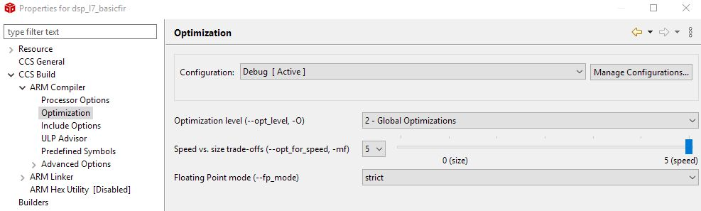

.. ECE 4703 

L7: Performance Optimization in DSP
===================================

The purpose of this lecture is as follows.

* To describe the factors that affect performance in DSP software
* To analyze the assembly code of typical DSP operations
* To discuss the purpose and use of DSP libraries
* To review examples of commerial DSP libaries

.. important::

   Before running the examples of this lecture, please update the msp432_boostxl_lib.
   This will resolve a bug in the DMA mechanism.

The cost of computations in DSP
^^^^^^^^^^^^^^^^^^^^^^^^^^^^^^^

In this lecture we are interested in understanding the factors that affect the performance
of DSP programs. As we discussed in Lecture 2 (:ref:`lec2`), the maximum allowed processing
time per sample cannot exceed the sample period. Within the interval of a single sample period,
the processor has to acquire data from the ADC, process the new sample following the rules
of the DSP algorithm, and finally convert the output sample to a DAC voltage.

We will break down the processing time of a DSP in its components, and then clarify how
these components can be reduced through optimization. In this lecture, the emphasis
lies on the software processing, i.e., the C code written for the Cortex-M4 ARM 
processor. In the next lecture, we investigate the role of the hardware.

The Software Flow
"""""""""""""""""

We start by briefly reminding the flow from C source code to a binary program for a DSP
processor. A C compiler, which accepts optimization flags, converts C code with
optional inline assembly into an *object file*, which contains processor instructions.
The C compiler also produces a *listing file* which relates C code and processor
instructions. 

The object file is not yet a binary program. All external symbols (such as library functions)
have to be resolved, and every variable and function has to be mapped to a concrete
memory address following a specific memory layout. Finally, the binary file can be downloaded
to the board, and it can also be disassembled to a listing file. The latter may be useful
to inspect the implementation of external library functions.

We will be investigating the assembly output of a few DSP programs to investigate the
factors that influence the complexity and cost of DSP program implementation. 
A useful document to understand assembly code produced by a compiler (and, in this case, assembly
code for the ARM Cortex-M4), is the `Procedure Call Standard for the ARM Architecture <https://developer.arm.com/documentation/ihi0042/latest/>`_. This document describes how a 
function call is implemented, and how basic data types (in C, C++) are implemented.
Of particular interest is Table 6.1 in this document, which is reproduced below. This table
indicates the functionality of the 16 processor registers in the ARM.

.. figure:: images/table61arm.jpg
   :figwidth: 600px
   :align: center

Besides these 16 processor registers, there are an additional 32 registers in the floating-point
coprocessor. These registers are addressed as ``s0-s31`` when used as single-precision registers,
``d0-d15`` when used as double-precision registers. ``d0`` overlaps ``s0-s1``, ``d1`` overlaps ``s2-s3``, and so forth. Furthermore when SIMD vector instructions are present, ``q0-q7`` represent quad-word registers.

Examing the basic FIR
^^^^^^^^^^^^^^^^^^^^^

Let's consider the following function, which represents a basic FIR.

.. code::

   uint16_t processSample(uint16_t x) {
       int input = adc14_to_q15(x);
   
       taps[0] = input;
   
       int q = 0;
       uint16_t i;
       for (i = 0; i<NUMTAPS; i++)
           q += (taps[i] * C[i]) >> 15;
   
       for (i = NUMTAPS-1; i>0; i--)
           taps[i] = taps[i-1];
   
       return q15_to_dac14(q);
   }

.. note::

   To set the optimization level of the compiler, right-click a project and select CCS Build - ARM Compiler - Optimization. 

   To inspect the assembly listing produced by the compiler, open the Debug folder in the project and
   look for the listing (.lst) file. You will find that listing files are very verbose; the code shown
   further is an edited version with the majority of comments removed.

We start by examining the output of the compiler without any optimization. Such code is sub-optimal, but also very easy to understand.

.. code::

   processSample:
           PUSH      {LR}                  
           SUB       SP, SP, #12           

           ; int input = adc14_to_q15(x);

           STRH      A1, [SP, #8]          
           LDRH      A1, [SP, #8]          
           BL        adc14_to_q15          
           STR       A1, [SP, #0]          

           ; taps[0] = input;

           LDR       A1, [SP, #0]          
           MOVW      A2, taps+0            
           MOVT      A2, taps+0            
           STR       A1, [A2, #0]          

           ; int q = 0;

           MOVS      A1, #0                
           STR       A1, [SP, #4]          

           ; for (i = 0; i<NUMTAPS; i++)

           MOVS      A1, #0                
           STRH      A1, [SP, #10]         
           LDRH      A1, [SP, #10]         
           CMP       A1, #32               
           BGE       ||$C$L61||            
   ||$C$L60||:    

           ; q += (taps[i] * C[i]) >> 15;

           LDRH      A1, [SP, #10]         
           LDRH      A3, [SP, #10]         
           MOVW      A2, C+0               
           MOVW      A4, taps+0            
           MOVT      A2, C+0               
           MOVT      A4, taps+0            
           LDR       A1, [A2, +A1, LSL #2] 
           LDR       A3, [A4, +A3, LSL #2] 
           LDR       A2, [SP, #4]          
           MULS      A1, A1, A3            
           ADD       A2, A2, A1, ASR #15   
           STR       A2, [SP, #4]          
           LDRH      A1, [SP, #10]         
           ADDS      A1, A1, #1            
           STRH      A1, [SP, #10]         
           LDRH      A1, [SP, #10]         
           CMP       A1, #32               
           BLT       ||$C$L60||                       
   ||$C$L61||:    

           ; for (i = NUMTAPS-1; i>0; i--)

           MOVS      A1, #31               
           STRH      A1, [SP, #10]         
           LDRH      A1, [SP, #10]         
           CMP       A1, #0                
           BLE       ||$C$L63||            
   ||$C$L62||:    

           ; taps[i] = taps[i-1];

           LDRH      A1, [SP, #10]         
           LDRH      A3, [SP, #10]         
           MOVW      A2, taps+0            
           MOVT      A2, taps+0            
           LSLS      A1, A1, #2            
           SUBS      A1, A1, #4            
           LDR       A1, [A2, +A1]         
           MOVW      A2, taps+0            
           MOVT      A2, taps+0            
           STR       A1, [A2, +A3, LSL #2] 
           LDRH      A1, [SP, #10]         
           SUBS      A1, A1, #1            
           STRH      A1, [SP, #10]         
           LDRH      A1, [SP, #10]         
           CMP       A1, #0                
           BGT       ||$C$L62||            

   ||$C$L63||:    

           ; return q15_to_dac14(q);

           LDRSH     A1, [SP, #4]          
           BL        q15_to_dac14          
           ADD       SP, SP, #12           
           POP       {PC}                  

The instructions fall apart in three broad categories.

1. Some instructions are related to the implementation of control flow operations in C. Loop counters, for example, imply the creation of a loop counter variable, a loop counter increment operations, and one or more conditional jump instructions.

2. Some instructions are related to the storage and retrieval of variables. In particular, variables are either stored in the stack (local variables such as ``input`` and ``q``), or else in main memory (global variables such as ``taps`` and ``C``). 

3. Some instructions do actual computations, and for a FIR filter these computations consist of multiply and accumulate.

Let's examine each of these instruction types in further detail.

Control Flow
""""""""""""

The ARM Cortex-M4 is a pipelined processor, meaning that pipeline hazards can occur
due to branches (control hazard) or memory access (data hazard). The ARM Cortex-M4 has a 3-stage pipeline with branch speculation, which reduces some of the penalty of a control hazard.

However, when considering a C program, it is useful to evaluate all aspects of the control
flow implementation of the C program. For example, let us highlight all instructions
related to the loop counter.

.. code::

           ; for (i = NUMTAPS-1; i>0; i--)

           MOVS      A1, #31               
           STRH      A1, [SP, #10]         
           CMP       A1, #0                
           LDRH      A1, [SP, #10]         
           BLE       ||$C$L63||            
   ||$C$L62||:    

           ...

           LDRH      A1, [SP, #10]         
           SUBS      A1, A1, #1            
           STRH      A1, [SP, #10]         
           LDRH      A1, [SP, #10]         
           CMP       A1, #0                
           BGT       ||$C$L62||            

There is, of course, overhead because of the absence of optimization. The loop counter
is moved on and off the stack multiple times. On the other hand, one can see that
a simple loop iteration without optimization costs 6 instructions per loop iteration,
where most of the memory-load instructions will cause a data-hazard, and where one
of the instructions is a branch. Clearly, loop counters in DSP programs are not free,
and for this reason, short loops with known bounds are unrolled.

Data Movement
"""""""""""""

A second important source of code is the computation of addresses. Each indexed
element access requires the computation of the address where that element is stored.
This address is given by the base address plus the size of an element (in bytes)
times the index.

.. figure:: images/array_address.jpg
   :figwidth: 300px
   :align: center

Address calculations quickly become an important factor in additional 'hidden'
computation costs. Consider for example the assembly code required
for a simple array-to-array copy. It contains 10 instructions! Again, there are some obvious inefficiencies in this code, but even without those, it's clear that there will be multiple instructions involved for every memory-to-memory copy.

.. code::

           ; taps[i] = taps[i-1];

           LDRH      A1, [SP, #10]             ; A1 = i
           LDRH      A3, [SP, #10]             ; A3 = i
           MOVW      A2, taps+0            
           MOVT      A2, taps+0                ; A2 = base(taps)
           LSLS      A1, A1, #2                ; A1 = i * 4
           SUBS      A1, A1, #4                ; A1 = (i -1) * 4
           LDR       A1, [A2, +A1]             ; A1 = MEM[base(taps) + (i -1) * 4]
           MOVW      A2, taps+0                ;
           MOVT      A2, taps+0                ; A2 = base(taps)
           STR       A1, [A2, +A3, LSL #2]     ; MEM[base(taps) + i*4] = A1

Calculations
""""""""""""

Finally, there are the actual computations, which include the multiply-accumulate operations of the FIR. The ARM processor has a relatively powerful execution unit, which can combine shifting and adding in a single operation. Consider for example the expression (taps[i] * C[i]) >> 15.
Stripping out the overhead of the address computations for ``taps[i]`` and ``C[i]``,
we are left with the following compact sequence.

.. code::

           ; q += (taps[i] * C[i]) >> 15;

           LDR       A1, [A2, +A1, LSL #2]    ; load taps[i]
           LDR       A3, [A4, +A3, LSL #2]    ; load C[i]
           LDR       A2, [SP, #4]             ; load q
           MULS      A1, A1, A3               ; tapsi] * C[i]
           ADD       A2, A2, A1, ASR #15      ; q = q + (tapsi] * C[i]) >> 15
           STR       A2, [SP, #4]             ; store q

In summary, the bulk of the instructions performed by the program are not directly related to the FIR multiply-accumulate operations. Instead, the bulk of instructions are related to various management tasks in C: supporting control flow operations, and supporting data structures in memory, for example. It is impossible to do good DSP program optimization while ignoring this aspect.

Optimizing for Size
^^^^^^^^^^^^^^^^^^^

When you write C code, the most important source of optimization is the C compiler. For simple programs (including the FIR design that we are currently investigating), the C compiler is very effective at analyzing the properties of the code and transforming it for minimal footprint or maximal performance. 

When optimizing for minimal footprint, we value code size over processor clock cycles. In an embedded processor, optimizing for size is important to minimize storage needs.

.. figure:: images/optimizer-settings.jpg
   :figwidth: 600px
   :align: center

Let's consider the impact of compiler optimization, set of Global Optimizations while minimizing code size.
The FIR program considered earlier now shrinks to the following set of instructions.

.. code::

          processSample:
                  PUSH      {V1, V2, V4, LR}      
                  BL        adc14_to_q15          
     
                  LDR       A2, $C$CON1           ; load base address taps
                  LDR       V1, $C$CON2           ; load base address C
     
                  MOVS      V4, #32               ; loop counter initalization
                  MOVS      A3, #0                ; accumulator initialization
                  MOV       V2, A2                
                  STR       A1, [A2, #0]          ; taps[0] = input
          ||$C$L1||:    
                  LDR       A4, [V2], #4          ; A4 = *taps++
                  LDR       A1, [V1], #4          ; A1 = *C++
                  SUBS      V4, V4, #1            ; decrement loop counter
                  MUL       A1, A1, A4            ; A1 = taps[i]*C[i]
                  ADD       A3, A3, A1, ASR #15   ; A3 += (A1 >> 15)
                  BNE       ||$C$L1||             
     
                  ADDS      A2, A2, #124          ; A2 = base address taps + (4*31)
                  MOVS      V4, #31               ; loop counter initialization
          ||$C$L2||:    
                  LDR       A1, [A2, #-4]         ; A1 = *taps - 1
                  SUBS      V4, V4, #1            ; decrement loop counter
                  STR       A1, [A2], #-4         ; *taps-- = A1
                  BNE       ||$C$L2||             
     
                  SXTH      A1, A3                ; sign-extend A3
                  BL        q15_to_dac14          
                  POP       {V1, V2, V4, PC}      

This code is worth discussing further, as it testifies the capabilities of compiler optimization.

* The amount of data movement is drastically reduced. In the non-optimized version,
  every local variable is stored on the stack. For every access, the local variable is read
  into a processor register. When the variable is modified, it is written back onto the stack.

* The code has been converted to use pointer arithmetic rather than using address expressions.
  Consider the a loop with ``C[i]`` and ``taps[i]``:

  .. code::

    for (i = 0; i<NUMTAPS; i++)
        q += (taps[i] * C[i]) >> 15;

  After compiler optimization, two pointers are introduced as follows:

  .. code::

    ptr1 = taps;
    ptr2 = C;
    for (i = 0; i<NUMTAPS; i++)
        q += (*ptr1++ * *ptr2++) >> 15;

  Similarly, the delay line shifting is converted from address arithmetic to pointers:

  .. code

    ptr = &taps[31];
    for (i = 0; i<NUMTAPS; i++)

* The loop counts down, instead of up. When decrementing a loop counter to zero, a simple
  test on the zero flag of the processor is sufficient to detect the end of the loop.
  When a loop counter counts up, an additional compare instruction is needed.

Optimizing for Performance
^^^^^^^^^^^^^^^^^^^^^^^^^^

The compiler can also optimize for performance. In that case the generated code is dramatically different from the optimization for size.

In this case, the compiler completely unrolls the loop, removing every control operation, including loop counter management and branch instructions.
The resulting code contains only memory-load and -store, as well as arithmetic.

.. code::

     PUSH      {V1, V2, V3, V4, V5, V6, V7, V8, LR}
     SUB       SP, SP, #60           
     BL        adc14_to_q15          
     MOVW      V1, C+0               
     MOVT      V1, C+0               
     MOVW      A4, taps+0            
     MOVT      A4, taps+0            
     LDR       A2, [V1, #124]       
     LDR       V2, [V1, #88]                
     LDR       A3, [A4, #124]      
     MULS      A2, A2, A3          
     LDR       A3, [A4, #88]       
     MUL       V3, A3, V2          
     LDR       V2, [A4, #92]       
     STR       A3, [A4, #92]       
     LDR       A3, [A4, #84]       
     LDR       V4, [V1, #84]       
     STR       A3, [A4, #88]       
     MULS      V4, A3, V4          
     LDR       A3, [A4, #80]       
     LDR       V9, [V1, #80]                
     STR       A3, [A4, #84]       
     MUL       V9, A3, V9          
     LDR       A3, [A4, #76]       
     LDR       LR, [V1, #76]                
     STR       A3, [A4, #80]       
     MUL       LR, A3, LR          
     LDR       A3, [A4, #72]       
     LDR       V5, [V1, #72]                
     STR       A3, [A4, #76]       
     MUL       V5, A3, V5          
     LDR       A3, [A4, #68]       
     LDR       V6, [V1, #68]                
     STR       A3, [A4, #72]       
     MUL       V6, A3, V6          
     LDR       A3, [A4, #64]       
     LDR       V7, [V1, #64]                
     STR       A3, [A4, #68]       
     MUL       V7, A3, V7          
     LDR       A3, [A4, #60]       
     LDR       V8, [V1, #60]                
     STR       A3, [A4, #64]         
     MUL       V8, A3, V8            
     STR       V8, [SP, #52]         
     LDR       A3, [A4, #56]         
     LDR       V8, [V1, #56]         
     STR       A3, [A4, #60]         
     MUL       V8, A3, V8            
     STR       V8, [SP, #48]         
     LDR       A3, [A4, #52]         
     LDR       V8, [V1, #52]         
     STR       A3, [A4, #56]         
     MUL       V8, A3, V8            
     STR       V8, [SP, #44]         
     LDR       A3, [A4, #48]         
     LDR       V8, [V1, #48]         
     STR       A3, [A4, #52]         
     MUL       V8, A3, V8            
     STR       V8, [SP, #40]         
     LDR       A3, [A4, #44]         
     LDR       V8, [V1, #44]         
     STR       A3, [A4, #48]         
     MUL       V8, A3, V8            
     STR       V8, [SP, #36]         
     LDR       A3, [A4, #40]         
     LDR       V8, [V1, #40]         
     STR       A3, [A4, #44]         
     MUL       V8, A3, V8            
     STR       V8, [SP, #32]         
     LDR       A3, [A4, #36]         
     LDR       V8, [V1, #36]         
     STR       A3, [A4, #40]         
     MUL       V8, A3, V8            
     STR       V8, [SP, #28]         
     LDR       A3, [A4, #32]         
     LDR       V8, [V1, #32]         
     STR       A3, [A4, #36]         
     MUL       V8, A3, V8            
     STR       V8, [SP, #24]         
     LDR       A3, [A4, #28]         
     LDR       V8, [V1, #28]         
     STR       A3, [A4, #32]         
     MUL       V8, A3, V8            
     STR       V8, [SP, #20]         
     LDR       A3, [A4, #24]         
     LDR       V8, [V1, #24]         
     STR       A3, [A4, #28]         
     MUL       V8, A3, V8            
     STR       V8, [SP, #16]         
     LDR       A3, [A4, #20]         
     LDR       V8, [V1, #20]         
     STR       A3, [A4, #24]         
     MUL       V8, A3, V8            
     STR       V8, [SP, #12]         
     LDR       A3, [A4, #16]         
     LDR       V8, [V1, #16]         
     STR       A3, [A4, #20]         
     MUL       V8, A3, V8            
     STR       V8, [SP, #8]          
     LDR       A3, [A4, #12]         
     LDR       V8, [V1, #12]         
     STR       A3, [A4, #16]         
     MUL       V8, A3, V8            
     STR       V8, [SP, #4]          
     LDR       A3, [A4, #8]          
     LDR       V8, [V1, #8]          
     STR       A3, [A4, #12]         
     MUL       V8, A3, V8            
     STR       V8, [SP, #0]          
     LDR       A3, [A4, #4]          
     LDR       V8, [V1, #4]          
     STR       A3, [A4, #8]          
     MUL       V8, A3, V8            
     LDR       A3, [V1, #0]          
     MULS      A3, A1, A3            
     ASRS      A3, A3, #15           
     ADD       A3, A3, V8, ASR #15   
     LDR       V8, [SP, #0]          
     ADD       A3, A3, V8, ASR #15   
     LDR       V8, [SP, #4]          
     ADD       A3, A3, V8, ASR #15   
     LDR       V8, [SP, #8]          
     ADD       A3, A3, V8, ASR #15   
     LDR       V8, [SP, #12]         
     ADD       A3, A3, V8, ASR #15   
     LDR       V8, [SP, #16]         
     ADD       A3, A3, V8, ASR #15   
     LDR       V8, [SP, #20]         
     ADD       A3, A3, V8, ASR #15   
     LDR       V8, [SP, #24]         
     ADD       A3, A3, V8, ASR #15   
     LDR       V8, [SP, #28]         
     ADD       A3, A3, V8, ASR #15   
     LDR       V8, [SP, #32]         
     ADD       A3, A3, V8, ASR #15   
     LDR       V8, [SP, #36]         
     ADD       A3, A3, V8, ASR #15   
     LDR       V8, [SP, #40]         
     ADD       A3, A3, V8, ASR #15   
     LDR       V8, [SP, #44]         
     ADD       A3, A3, V8, ASR #15   
     LDR       V8, [SP, #48]         
     ADD       A3, A3, V8, ASR #15   
     LDR       V8, [SP, #52]         
     ADD       A3, A3, V8, ASR #15   
     ADD       A3, A3, V7, ASR #15   
     ADD       A3, A3, V6, ASR #15   
     LDR       V7, [V1, #116]        
     LDR       V6, [V1, #112]        
     ADD       A3, A3, V5, ASR #15   
     ADD       A3, A3, LR, ASR #15   
     ADD       A3, A3, V9, ASR #15   
     ADD       A3, A3, V4, ASR #15   
     ADD       A3, A3, V3, ASR #15   
     LDR       V5, [V1, #108]        
     LDR       LR, [V1, #104]        
     LDR       V9, [V1, #100]        
     LDR       V4, [V1, #96]         
     LDR       V3, [V1, #92]         
     MULS      V3, V2, V3            
     ADD       A3, A3, V3, ASR #15   
     LDR       V3, [A4, #96]         
     STR       A1, [A4, #0]          
     MULS      V4, V3, V4            
     ADD       A3, A3, V4, ASR #15   
     LDR       V4, [A4, #100]        
     STR       A1, [A4, #4]          
     MUL       V9, V4, V9            
     ADD       A3, A3, V9, ASR #15   
     LDR       V9, [A4, #104]        
     STR       V2, [A4, #96]         
     MUL       LR, V9, LR            
     STR       V3, [A4, #100]        
     ADD       A3, A3, LR, ASR #15   
     LDR       LR, [A4, #108]        
     STR       V4, [A4, #104]        
     MUL       V5, LR, V5            
     ADD       A3, A3, V5, ASR #15   
     LDR       V5, [A4, #112]        
     STR       V9, [A4, #108]        
     MUL       V6, V5, V6            
     ADD       A3, A3, V6, ASR #15   
     LDR       V6, [A4, #116]        
     STR       LR, [A4, #112]        
     MUL       V7, V6, V7            
     ADD       A3, A3, V7, ASR #15   
     STR       V5, [A4, #116]        
     LDR       V7, [V1, #120]        
     LDR       V1, [A4, #120]        
     STR       V1, [A4, #124]        
     MUL       V7, V1, V7            
     STR       V6, [A4, #120]        
     ADD       A3, A3, V7, ASR #15   
     ADD       A3, A3, A2, ASR #15   
     SXTH      A1, A3                
     BL        q15_to_dac14          
     ADD       SP, SP, #60           
     POP       {V1, V2, V3, V4, V5, V6, V7, V8, PC} 

Comparing Non-optimized and Optimized Code
^^^^^^^^^^^^^^^^^^^^^^^^^^^^^^^^^^^^^^^^^^

Let's compare the three epamples we discussed so far: the unoptimized code, versus the compiler-optimized code (optimized for size), versus performance-optimized code (optimized for performance). For each implementation, we collected the following metrics.

1. The number of instructions in the static program image. This metric represents the cost of storing instructions.
2. The number of instructions executed to deal with data movement, including address expressions, and load/store operations.
3. The number of instructions executed to deal with control, including loop counting and branches.
4. The number of instructions executed for actual FIR calculations, such as multiply and accumulate.
5. The cycle count of the ``processSample`` function.

.. _asmtable:

+-------------------------+----------------------+----------------------+-------------------------+
| ProcessSample           |  Non-optimized       |  Optimized (size)    | Optimized (Performance) |
+=========================+======================+======================+=========================+
| Instructions in Binary  |      60              |       23             |   198                   |
+-------------------------+----------------------+----------------------+-------------------------+
| Exec Ins Data Movement  |         682          |      134             |     123                 |
+-------------------------+----------------------+----------------------+-------------------------+
| Exec Ins Control        |         336          |     132              |      8                  |
+-------------------------+----------------------+----------------------+-------------------------+
| Exec Ins Calculations   |         64           |      64              |      64                 |
+-------------------------+----------------------+----------------------+-------------------------+
| Cycle Count             |       1698           |      546             |      277                |
+-------------------------+----------------------+----------------------+-------------------------+

We make the following observations. First, performance can be dramatically improved through compiler optimization.
We observe a factor 6.12x using automatic techniques (this could be even further improved with manual
optimizations such as the circular-buffer optimization we discussed earlier). 

Second, the number
of instructions devoted to calculations remains constant. This is not a surprise, since we have to
compute all taps of the filter. The only method to reduce the calculations further would be to
exploit the knowledge of the filter coefficient values, for example skipping the multiplications
with zero, or using add-shift expansion on constant multiplications.

A Caveat
""""""""

Despite the impressive performance gains achieved through compiler optimization, it is crucial
that performance gains are validated. You have to check your assumptions and evaluate every
optimization you make by *measuring* the resulting performance. The following example serves
to illustrate this point. Consider the circular-buffer design we discussed earlier. A circular
buffer design eliminates shifting of the taps at the expense of slightly more complex address
expressions. By keeping the number of taps (NUMTAPS) at a power of 2, the operation ``% NUMTAPS``
can be implemented efficiently by a bitwise and with ``& (NUMTAPS-1)``.

.. code::

   static uint16_t head;
   
   uint16_t processSample(uint16_t x) {
       int input = adc14_to_q15(x);
   
       taps[(NUMTAPS - head) % NUMTAPS] = input;
   
       int q = 0;
       uint16_t i;
       for (i = 0; i<NUMTAPS; i++)
           q += (taps[i] * C[(i + head) % NUMTAPS]) >> 15;
   
       head = (head + 1) % NUMTAPS;
   
       return q15_to_dac14(q);
   }

However, what about aggressive compiler optimization for performance? The result is not clear-cut.
When you unroll a loop, then there is no simple optimization that will lead to the address
of ``C[(i + head) % NUMTAPS])`` without doing an addition with ``head`` followed by a bitwise
AND operation. Hence, even after unrolling, the amount of address calculations remains
relatively high. 

+-------------------------+----------------------+----------------------+-------------------------+
| ProcessSample           |  Non-optimized       |  Optimized (size)    | Optimized (Performance) |
+=========================+======================+======================+=========================+
| Cycle Count             |       1230           |      410             |      413                |
+-------------------------+----------------------+----------------------+-------------------------+

Measurement of the cycle counts for the circular-buffer case confirms that
aggressive optimization actually deteriorates performance. Without detailed study of the
assembly code, it's hard to tell why the size-optimized case is faster than the performance-optimized
case. At least, the example demonstrates that *in performance optimization, you always have to verify your assumptions*.

DSP Libraries: ARM CMSIS 
^^^^^^^^^^^^^^^^^^^^^^^^

Despite the need for optimize DSP code to achieve real-time performance, there is also a relentless pressure
to develop code faster. A solution for this conundrum is to make use of a library with optimized
primitives. The `ARM CMSIS Library <https://www.keil.com/pack/doc/CMSIS/DSP/html/index.html>`_ contains
a suite of common signal processing functions for use on Cortex-M and Cortex-A processor based devices.
The advantage of such a library is threefold. First, a library improves the speed of software development.
Second, the library functions can be highly optimized for the underlying architecture.
Third, the library's application programmer's interface (API) offers a portable design that enables
the same application code to execute across multiple platforms. 

We'll look at the design of a FIR filter using ARM CMSIS. In contrast to our previous design, this filter
reads in a block of samples, rather than a single sample at a time. The reason for doing so is to
improve the parallellism of the specification. In a typical 64-bit architecture, 16-bit samples can
be represented in parallel as a vector. Furthermore, advanced members of the ARM family have vector
instructions, which are able to perform four concurrent 16-bit operations in a 64-bit datapath.
While it's beyond the scope of this lecture to dive into the internal details of ``arm_fir_q15``,
you can do so on your own as the source code is available as part of the SimpleLink MSP432
package you are using on the course (See `arm_fir_q15.c <file:C:/ti/simplelink_msp432p4_sdk_3_40_01_02/source/third_party/CMSIS/DSP_Lib/Source/FilteringFunctions/arm_fir_q15.c>`_).

.. important::

   .. code::

      void arm_fir_q15 ( const arm_fir_instance_q15 *  S,
                         const q15_t *   pSrc,
                         q15_t *   pDst,
                         uint32_t  blockSize 
                       )

   **Parameters**

     * [in]  ``S`` points to an instance of the Q15 FIR filter structure
     * [in]  ``pSrc``  points to the block of input data
     * [out] ``pDst``  points to the block of output data
     * [in]  ``blockSize`` number of samples to process

   **Returns**

   none

   **Scaling and Overflow Behavior**

   The function is implemented using a 64-bit internal accumulator. Both coefficients and state variables are represented in 1.15 format and multiplications yield a 2.30 result. The 2.30 intermediate results are accumulated in a 64-bit accumulator in 34.30 format. There is no risk of internal overflow with this approach and the full precision of intermediate multiplications is preserved. After all additions have been performed, the accumulator is truncated to 34.15 format by discarding low 15 bits. Lastly, the accumulator is saturated to yield a result in 1.15 format.

To use of a block-driven format, we will switch from an interrupt-driven design to a DMA-controlled design; we will discuss the details of the DMA-controlled design in our next lecture.

The following application illustrates the use of ``arm_fir_q15``.

.. code::

  #define NUMTAPS 32
  int16_t taps[NUMTAPS + BUFLEN_SZ - 1];
  int coefficients[NUMTAPS] = { (int) (1 * (1 << 15)) };
  arm_fir_instance_q15 F;
  
  initfir(arm_fir_instance_q15 *F) {
      F->numTaps  = NUMTAPS;
      F->pState   = taps;
      F->pCoeffs  = coefficients;
  }
  
  void processBuffer(uint16_t x[BUFLEN_SZ], uint16_t y[BUFLEN_SZ]) {
      adc14_to_q15_vec(x, x, BUFLEN_SZ);
      arm_fir_q15(&F, x, y, BUFLEN_SZ);
      q15_to_dac14_vec(y,y, BUFLEN_SZ);
  }
  
  
  #include <stdio.h>
  
  int main(void) {
      WDT_A_hold(WDT_A_BASE);
  
      initfir(&F);
  
      msp432_boostxl_init_dma(FS_32000_HZ, BOOSTXL_J1_2_IN, BUFLEN, processBuffer);
  
      uint32_t c = measurePerfBuffer(processBuffer);
      printf("Cycles: %d\n", c);
  
      msp432_boostxl_run();
  
      return 1;
  }

* The size of the buffer with filter state is now the number of taps plus the block
  length minus 1 (``NUMTAPS + BUFLEN_SZ - 1``). The reason for this larger buffer, is
  that the filter state will be updated with ``BUFLEN_SZ`` samples at a time.

* The filter state is stored in a record of type ``arm_fir_instance_q15``, which also
  holds the coefficients and their count. A separate initialization function ``initfir``
  is added to initialize the ``arm_fir_instance_q15``. Detailed documentation
  on `arm_fir_instance_q15 <https://www.keil.com/pack/doc/CMSIS/DSP/html/structarm__fir__instance__q15.html>`_ can be found online.

* The ``processSample`` is now replaced with a ``processBuffer`` function, which filters a
  block of samples. Note that :ref:`msp432_boostxl_lib` has functions to convert 
  a vector of samples from the ADC/to the DAC to internal q15, f32 or q31 datatype.

* The ``main`` function creates a DMA block-based setup rather than an interrupt-driven
  sample-based setup. The key parameter is ``BUFLEN``, which describes the blocksize
  used by the DMA. We will discuss the detailed internal operation of the DMA mechanism in our
  next lecture. For now, the key point is that the DMA mechanism will collect a block
  of ``BUFLEN`` samples (each one sample period apart) from the ADC, and then calls
  ``processBuffer``. After this function returns, the resulting ``BUFLEN`` output samples 
  are submitted to the DAC, one at a time and spaced one sample period apart.

Finally, let's look at the resulting performance of the design when using the DMA
mechanism. Not surprisingly, because of the use of a DSP library, the impact of the
compiler optimization is negligible. The use of a DSP library is about 2.2x faster than
non-optimized code, but on the other hand, our manual optimizations outperform the DSP
library filter by a factor of 2.7x. Note that this comparison is for the specific case
of a Cortex-M4; and using a more powerful ARM (Cortex-A) may yield a different comparison.

+-------------------------+----------------------+----------------------+-------------------------+
| processBuffer           |  Non-optimized       |  Optimized (size)    | Optimized (Performance) |
+=========================+======================+======================+=========================+
| Cycle Count (Buffer)    |       6088           |      6081            |     6081                |
+-------------------------+----------------------+----------------------+-------------------------+
| Cycle Count (Sample)    |       762            |      760             |     760                 |
+-------------------------+----------------------+----------------------+-------------------------+

Conclusions
^^^^^^^^^^^

We considered the problem pf performance optimization, by looking in detail at the code produced
by a C compiler. We identified three factors that determine the execution time of DSP algorithm:
the computations such as multiply and accumulate, the control operations such as loops, and
the data load and store operations with address calculations. 

The overhead of control operations and data load and store operations is significant, but it can
be greatly reduced with compiler optimization. The compiler optimizer makes a trade-off between
optimizing for storage cost (code size), and optimizing for performance. Each of these have a different impact on the balance of computation/control/data load-store operations.

Finally, we briefly discussed the ARM-CMSIS library, a library with pre-made DSP functions available for ARM.

The code examples for this lecture are `available online <https://github.com/wpi-ece4703-b20/dsp_l7>`_.